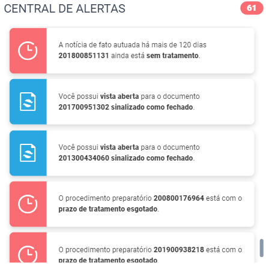

Alertas
=======

.. contents:: :local:

   Componente de Alertas

User Manual
~~~~~~~~~~~

O componente de alerta, como o nome já diz, serve para entregar alertas e notificações sobre assuntos de possível interesse do promotor, de maneira centralizada.

Os seguintes alertas estão implementados:

- Documentos com novas ITs do GATE;
- ICs sem prorrogação por mais de um ano;
- Documentos com vitimas recorrentes recebidos nos ultimos 30 dias;
- Ofício fora do prazo;
- Expedientes de Ouvidoria (EO) pendentes de recebimento;
- Procedimento Preparatório fora do prazo;
- PAs sem prorrogação por mais de um ano;
- Processo possivelmente prescrito;
- Vistas abertas em documentos já fechados;
- Notícia de Fato a mais de 120 dias;
- Movimento em processo de segunda instância.

Alguns outros alertas estão disponíveis, porém não estão "ativados" no código, já que ainda precisam ser revistos e testados:

- Documentos criminais sem retorno do TJ há mais de 60 dias;
- Documentos não criminais sem retorno do TJ há mais de 120 dias;
- Documentos com Órgão Responsável possivelmente desatualizado.

Explicando rapidamente um a um, temos:

Documentos com novas ITs do GATE
    O alerta é levantado para documentos que possuem uma IT do GATE e que não tiveram vistas abertas depois da data da IT. Isso vale também para documentos que nunca tiveram vistas abertas. Aqui são considerados todos os documentos, sem filtros por classe, por status ou fase, o que quer dizer que até mesmo documentos que foram cancelados ou que constam no sistema como concluídos serão levados em consideração, caso não tenham tido vistas abertas depois de uma IT do GATE.

ICs sem prorrogação por mais de um ano
    São considerados documentos que não foram cancelados e que ainda estão como Em Andamento no sistema, e que sejam da classe de IC, conforme a tabela abaixo:
    
    +-----------------------------------+-----------------------------------+
    | cldc_dk                           | hierarquia                        |
    +===================================+===================================+
    | 392                               | EXTRAJUDICIAIS > PROCEDIMENTOS DO |
    |                                   | MP > Inquérito Civil              |
    +-----------------------------------+-----------------------------------+

    Esses documentos não podem ter correlacionamento do tipo "Apenso" ou "Anexo" com outros documentos. Além disso, o documento precisa ter tido pelo menos um andamento, que não tenha sido cancelado, dos seguintes tipos:

    +-----------------------------------+-----------------------------------+
    | tppr_dk                           | hierarquia                        |
    +===================================+===================================+
    | 6291                              | MEMBRO > Despacho > Prorrogação   |
    |                                   | de Prazo de Investigação          |
    +-----------------------------------+-----------------------------------+
    | 6511                              | MEMBRO > Conversão > Conversão de |
    |                                   | Procedimento Administrativo em    |
    |                                   | Inquérito Civil                   |
    +-----------------------------------+-----------------------------------+
    | 6012                              | MEMBRO > Portaria > Instauração   |
    |                                   | de Inquérito Civil                |
    +-----------------------------------+-----------------------------------+
    | 6002                              | MEMBRO > Conversão > Conversão de |
    |                                   | Procedimento Preparatório em      |
    |                                   | Inquérito Civil                   |
    +-----------------------------------+-----------------------------------+

    O alerta é ativado nos casos em que a data do andamento mais recente (dos tipos acima) ocorreu há mais de um ano.

Documentos com vitimas recorrentes recebidos nos ultimos 30 dias
    Para este alerta, são considerados os documentos (que tenham sido cancelados ou não, que estejam Em Andamento ou não) que tenham personagens com os seguintes tipos:
    
    +-----------------------------------+-----------------------------------+
    | tppe_dk                           | descricao                         |
    +===================================+===================================+
    | 3                                 | Vítima                            |
    +-----------------------------------+-----------------------------------+
    | 290                               | Autor do fato/vítima              |
    +-----------------------------------+-----------------------------------+

    Além disso, a coluna de matéria do documento (docu_mate_dk) deve estar associada à matéria do seguinte tipo (a descrição se encontra na tabela MPRJ_MATERIA_MGP schema MPRJ do Oracle - não está no BDA):

    +-----------------------------------+------------------------------------------------+
    | mate_dk                           | descricao                                      |
    +===================================+================================================+
    | 43                                | Violência Doméstica e Familiar contra a Mulher |
    +-----------------------------------+------------------------------------------------+

    Em seguida, com esses documentos em mãos, são selecionados aqueles cuja data de cadastro ocorreu dentro dos últimos 30 dias. Os personagens de cada um desses documentos recentes serão então comparados com os personagens de todos os outros documentos (tanto os mais antigos, quanto os outros que também ocorreram neste intervalo de 30 dias). Desta forma, caso uma vítima tenha aparecido em dois documentos recentes, o alerta será levantado para estes dois documentos.

    Dois personagens em documentos diferentes são considerados a mesma pessoa caso:

    - A chave primária de pessoa na tabela (pess_dk) for igual;
    - O CPF dos dois existem e são iguais (com exceção de CPFs = 00000000000);
    - O RG dos dois existem e são iguais;
    - O nome da pessoa, e o nome da mãe na tabela existem e são iguais;
    - O nome da pessoa, e a data de nascimento dela existem e são iguais.

    Caso essas comparações encontrem a mesma pessoa em outros documentos, o alerta é levantado para aquele documento.
    

Ofício fora do prazo
    Para este alerta, são considerados documentos que não foram cancelados, e que ainda estão Em Andamento no sistema. Eles também devem possuir obrigatoriamente um andamento do seguinte tipo:

    +-----------------------------------+------------------------------------------------+
    | tppr_dk                           | hierarquia                                     |
    +===================================+================================================+
    | 6497                              | SERVIDOR > Cumprimento de Diligências > Ofício |
    +-----------------------------------+------------------------------------------------+

    Caso o documento possua mais de um andamento deste tipo, para fins do alerta será considerado o mais antigo (ou seja, que gerou o alerta primeiro). O alerta é levantado caso a data de andamento do ofício mais antigo tenha ocorrido há mais de um ano.

    É importante notar que, caso o documento tenha tido um andamento de ofício, este alerta será gerado ad eternum, até que o documento seja cancelado ou concluído no sistema. Não há, atualmente, nenhuma verificação de cumprimento do ofício para parar de gerar o alerta.

    !! PARECE TER UM BUG AQUI, o andamento usado é "Cumprimento de Diligências", então parece que esse seria um andamento para parar de gerar o alerta, e não para começar a gerar. Buscando os tipos de Andamentos com "Ofício" no nome, acham-se os seguintes tipos:

    6614	MEMBRO > Despacho > Expedição de Documento > Ofício > Via Grupo de Apoio aos Promotores (GAP) 
    6615	MEMBRO > Despacho > Expedição de Documento > Ofício > Via Técnico de Notificações (TNAI) 
    6616	MEMBRO > Despacho > Expedição de Documento > Ofício > Outros meios
    6617	SERVIDOR > Cumprimento de Diligências > Ofício > Via Grupo de Apoio aos Promotores (GAP) 
    6618	SERVIDOR > Cumprimento de Diligências > Ofício > Via Técnico de Notificações (TNAI) 
    6619	SERVIDOR > Cumprimento de Diligências > Ofício > Outros meios
    6497	SERVIDOR > Cumprimento de Diligências > Ofício
    6581	MEMBRO > Despacho > Expedição de Documento > Ofício
    6126	SERVIDOR > Área Administrativa/CGMP > Diligências > Ofício
    1042	Autuação de Expediente administrativo como Inquérito civil "de ofício"
    6989	MEMBRO > ATOS COMUNS > Diligências > Ofício
    7436	SERVIDOR > ATOS COMUNS > Diligências > Ofício
    6211	SERVIDOR > Área Administrativa/CGMP > Regularização de pendências > Resposta de ofício

    !! Bater isso com o Matheus, porque a regra de negócio deste alerta não parece estar correta

Expedientes de Ouvidoria (EO) pendentes de recebimento
    asdasdasd

Procedimento Preparatório fora do prazo
    asdafasfasf

PAs sem prorrogação por mais de um ano
    saeqwrasf

Processo possivelmente prescrito
    qwrqtqwt

Vistas abertas em documentos já fechados
    teweyeryery

Notícia de Fato a mais de 120 dias
    wrqesdgvs

Movimento em processo de segunda instância
    rwgsdgrt

Estrutura do Código
~~~~~~~~~~~~~~~~~~~

Processo BDA
************

::

   Nome da Tabela: MMPS_ALERTAS
   Colunas: 
      alrt_docu_dk (int)
      alrt_docu_nr_mp (string)
      alrt_docu_nr_externo (string)
      alrt_docu_etiqueta (string)
      alrt_docu_classe (string)
      alrt_docu_date (timestamp)
      alrt_orgi_orga_dk (int)
      alrt_classe_hierarquia (string)
      alrt_dias_passados (int)
      alrt_descricao (string)
      alrt_sigla (string)
      alrt_session (string)
      dt_partition (string)
    
A geração da tabela no BDA é feita da seguinte maneira:

Cada alerta é separado em um script separado, com uma função que realiza os cálculos necessários para aquele alerta específico. Os cálculos e metadados dos cálculos em si não são salvos na tabela final de alertas, eles são apenas utilizados para dizer quais documentos ativaram aquele alerta.

No script principal (Jobs_), os alertas são associados a siglas, descrições e suas funções respectivas. Cada uma dessas funções é então chamada, e o resultado é utilizado para salvar os resultados numa tabela temporária (com uma coluna indicando a qual tipo de alerta aqueles resultados pertencem - ``alrt_sigla``). Ao fim deste processo, a tabela temporária é então utilizada para escrever na tabela final ``MMPS_ALERTAS``. Além disso, informações daquela sessão de cálculo são salvas na tabela ``MMPS_ALERTA_SESSAO``. Esta tabela será usada no backend para definir a sessão mais recente, e pegar os alertas correspondente a ela.

A coluna ``dt_partition`` é utilizada para particionar a tabela de acordo com a data do cálculo. Também vale dizer que as tabelas ``MCPR_DOCUMENTO`` e ``MCPR_VISTA`` são cacheadas no início deste processo, para melhorar o desempenho dos cálculos que as utilizam frequentemente.

Em seguida, vamos explicitar melhor o processo e regras utilizadas em cada um dos alertas implementados:

GATE
^^^^
Documentos com novas ITs do GATE

AlertaGate_

O que este alerta faz é basicamente:
- Pega a vista mais recente, max(dt_abertura_vista), para cada documento;
- Pega as datas de IT do GATE para cada documento;
- Filtra as ITs para considerar apenas aquelas que ocorreram depois da max(dt_abertura_vista);
- Se tiver mais de uma IT no documento nessa condição, considera-se a mais antiga, que ativou o alerta primeiro.

Também são consideradas as ITs de documentos que não tiveram vista aberta ainda. Assim, se tiver ITs mais recentes do que a última vista (ou doc sem vista), o alerta será ativado para aquele documento.

IC1A
^^^^

MVVD
^^^^

OFFP
^^^^

OUVI
^^^^

PA1A
^^^^

PPFP
^^^^

VADF
^^^^

NF30
^^^^

DT2I
^^^^

PRCR
^^^^

- se data do fato não existir ou for maior que data de cadastro usa data de cadastro
- se pena for nula desconsidera
- se alguma pena no documento for de assunto multiplicador multiplica tudo pelo fator
- se o cara tiver menos de 21 ou >= 70 na data do fato ou data atual divide tempo de prescrição por 2 (usando os mesmos tipos de personagens que definimos pros investigados da PIP)
- data inicial de prescrição com a hierarquia de: 
    - se for abuso de menor e o menor tiver menos de 18 anos na data do fato (ou data de cadastro nas condições do primeiro ponto), usa a data de 18 anos como data inicial
    - se tiver acordo de não persecução penal e tiver rescisão, usa a data do andamento de rescisão do ANPP
    - senão, usa data do fato (ou data de cadastro nas condições lá)
- data final de prescrição = data inicial + tempo de prescrição
- O alerta, por enquanto, é ativado apenas uma vez por documento (não por assunto), e é usada a data final de prescrição mais antiga dos assuntos (então se eu tenho um documento com duas prescrições, uma em 2018 e outra em 2019, ele vai ativar uma única vez, indicando que o trigger do alerta já tem 720 dias - referente à prescrição de 2018 que é a mais antiga)

Ah, e claro, os tipos de personagem pra identificar os menores é aquilo que eu te mandei no outro dia: Adolescente, Adolescente Carente, Adolescente/Criança em Situação de Risco, Autor do Fato/Vítima, Menor, Vítima.
Esses 6 tipos. Em alguns casos a gente pode acabar considerando o autor do fato como vítima, mas se ele não tiver menos de 18 anos não vai fazer diferença na data inicial de prescrição. E se tiver, bom, é uma possível prescrição, então não acho que pode dar problema

.. _Jobs: https://github.com/MinisterioPublicoRJ/alertas/blob/develop/src/alertas/jobs.py
.. _AlertaGATE: https://github.com/MinisterioPublicoRJ/alertas/blob/optimization/alertas/src/alertas/alerta_gate.py

View Backend
************

::

   GET dominio/endpoint/

   HTTP 200 OK
   Allow: GET, HEAD, OPTIONS
   Content-Type: application/json
   Vary: Accept

   {
       "atributo1": 1,
       "atributo2": 2,
   }

Nome da View: `ViewTal`_.

.. _ViewTal: url da view no github

Dependências
~~~~~~~~~~~~

- Dependência 1
- Dependência 2

Troubleshooting
~~~~~~~~~~~~~~~
