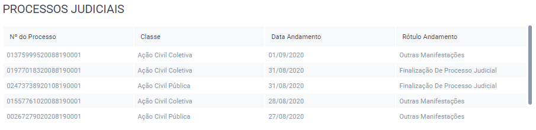

Lista de Processos
==================

.. contents:: :local:

   Componente de Lista de Processos

User Manual
~~~~~~~~~~~

O componente de Lista de Processos é usado para indicar os andamentos dos processos judiciais associados ao órgão. Só são considerados documentos e andamentos que não tenham sido cancelados, e que estejam ainda com status Em Andamento.

Para que estes cálculos sejam feitos corretamente, é necessário que o órgão tenha um pacote definido na tabela :ref:`tabelas-auxiliares-atualizacao-pj-pacote`, e que este pacote tenha classes de documentos associadas na tabela :ref:`tabelas-auxiliares-tb-regra-negocio-processo`, que serão usadas para identificar quais documentos correspondem a processos. Ao clicar na referência da tabela de regras acima, é possível verificar quais classes estão atualmente definidas.

Este componente também mostra, para os documentos que entram nestes critérios, uma pequena lista dos personagens daquele processo, que tenham sido registrados no sistema com algum dos seguintes tipos de personagem:
 
+-----------------------------------+-----------------------------------+
| tppe_dk                           | descricao                         |
+===================================+===================================+
| 5                                 | Vítima                            |
+-----------------------------------+-----------------------------------+
| 7                                 | Autor(a)                          |
+-----------------------------------+-----------------------------------+
| 14                                | Investigado(a)                    |
+-----------------------------------+-----------------------------------+
| 20                                | Denunciado(a)                     |
+-----------------------------------+-----------------------------------+
| 21                                | Autor(a) do Fato                  |
+-----------------------------------+-----------------------------------+
| 32                                | Reclamado                         |
+-----------------------------------+-----------------------------------+
| 40                                | Representado(a)                   |
+-----------------------------------+-----------------------------------+
| 290                               | Autor do fato/vítima              |
+-----------------------------------+-----------------------------------+
| 317                               | Autuado                           |
+-----------------------------------+-----------------------------------+
| 345                               | Representado (Corregedoria)       |
+-----------------------------------+-----------------------------------+

Além disso, caso o personagem seja do tipo 7 (Autor), uma série de expressões regulares é utilizada para excluir o Ministério Público e/ou a Defensoria Pública da lista de personagens que será mostrada no componente.

Alguns cálculos de similaridade entre nomes de personagens também são realizados para retirar possíveis repetições de nomes muito parecidos da lista final. O tamanho da lista de personagens a ser enviada também pode ser setada no processo. Atualmente, ela mostra apenas um nome, seguido de "e outros..." caso haja outros nomes associados ao documento.

Por último, uma URL que leva o usuário ao processo no site do TJRJ é adicionada aos dados que são enviados. Para isto, olha-se para o número externo do documento (coluna docu_nr_externo). Caso ele possua 20 dígitos, o que seria indicativo de um número externo de processo no TJRJ, adicionam-se os pontos "." e traços "-" nos devidos locais, para formar uma URL no seguinte formato:

http://www4.tjrj.jus.br/numeracaoUnica/faces/index.jsp?numProcesso=XXXXXXX-XX.XXXX.X.XX.XXXX

Estrutura do Código
~~~~~~~~~~~~~~~~~~~

Processo BDA
************

::

   Nome da Tabela: TB_LISTA_PROCESSOS
   Colunas: 
      orgao_dk (int)
      cldc_dk (string)
      docu_nr_mp (string)
      docu_nr_externo (string)
      docu_tx_etiqueta (string)
      personagens (string)
      dt_ultimo_andamento (timestamp)
      ultimo_andamento (string)
      url_tjrj (string)

!! cldc_dk aqui é a descrição, e não o dk propriamente dito. Idealmente isso deveria ser mudado para ficar mais claro.

O processo no BDA consiste em realizar os cálculos descritos na seção User Manual, e em seguida salvar os resultados na tabela TB_LISTA_PROCESSOS.

Cada cálculo sobrescreve os resultados anteriores.

URL do Script: https://github.com/MinisterioPublicoRJ/scripts-bda/blob/master/robo_promotoria/src/tabela_lista_processos.py.

View Backend
************

::

   GET /dominio/lista/processos/<orgao_id>

   HTTP 200 OK
   Allow: GET, HEAD, OPTIONS
   Content-Type: application/json
   Vary: Accept

   {
       "id_orgao": 100,
       "classe_documento": "Ação Tal Tal",
       "docu_nr_mp": "2010000000",
       "docu_nr_externo": "12345123451234512345",
       "docu_etiqueta": "Etiqueta tal tal",
       "docu_personagens": "Fulano, e outros...",
       "dt_ultimo_andamento": "2020-02-11T16:27:09.273000Z",
       "ultimo_andamento": "Andamento tal tal",
       "url_tjrj": "http://www4.tjrj.jus.br/numeracaoUnica/faces/index.jsp?numProcesso=XXXXXXX-XX.XXXX.X.XX.XXXX"
   }

Nome da View: `ListaProcessosView`_. 

O seu objetivo é basicamente acessar a tabela TB_LISTA_PROCESSOS no BDA, filtrando o resultado pelo órgão que está sendo analisado, ordenando pela data de andamento mais recente (dentro do intervalo definido de 1 semana), serializar os dados, e retornar o resultado na resposta. Também é feita a paginação dos dados, com um padrão de 20 linhas em cada página.

.. _ListaProcessosView: https://github.com/MinisterioPublicoRJ/apimpmapas/blob/develop/dominio/tutela/views.py#L509

Dependências
~~~~~~~~~~~~

-  :ref:`tabelas-auxiliares-atualizacao-pj-pacote`
-  :ref:`tabelas-auxiliares-tb-regra-negocio-processo`
-  Tabelas do Exadata

Troubleshooting
~~~~~~~~~~~~~~~

Verificar se tem pacote definido na tabela de pacotes.
Verificar se o pacote tem regras definidas na tabela de regras de negocios processos.
Caso esteja vindo vazio ainda assim, verificar que o órgão em questão tenha tido andamentos em documentos das classes definidas na última semana. 