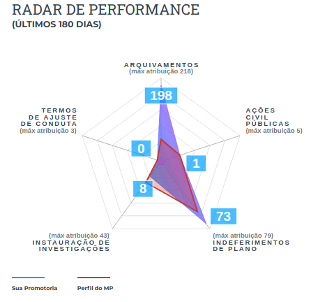

Radar de Performance
====================

.. contents:: :local:

O Radar de Performance é um componente destinado a facilitar a análise das ações que estão sendo tomadas pela promotoria, e comparar com outros órgãos de mesma atribuição. 

Os endpoints e tabelas dos Radares de Performance de PIP e Tutela são separados. Assim, eles serão tratados também em subseções separadas.

Radar de Performance da Tutela
------------------------------

User Manual
~~~~~~~~~~~

O Radar de Performance da Tutela analisa 5 eixos de ação da promotoria:

- Arquivamentos;
- Ações Civis Públicas (ACPs);
- Indeferimentos de Plano;
- Instaurações de Investigação;
- e Termos de Ajuste de Conduta (TACs).

Para cada um destes eixos temos o número total de andamentos detectados num período de 6 meses, assim como o valor máximo presente em um mesmo órgão daquela atribuição. Os andamentos não podem ter sido cancelados, e nem o documento ao qual se referem. 

O gráfico permite analisar, visualmente, quais eixos estão mais próximos do máximo, e quais estão mais próximos de 0. Além disso, é possível ver o perfil médio daquela atribuição em cada um dos eixos. Assim, pode-se comparar a promotoria em questão, com o comportamento médio dos outros órgãos similares a ela.

Os tipos de andamento considerados em cada um dos 5 eixos são os seguintes:

Regras de Arquivamento
**********************

+-----------------------------------+-----------------------------------+
| tppr_dk                           | hierarquia                        |
+===================================+===================================+
| 6015                              | MEMBRO > Arquivamento > Com       |
|                                   | remessa ao Conselho Superior >    |
|                                   | Integral sem TAC (Tutela          |
|                                   | individual)                       |
+-----------------------------------+-----------------------------------+
| 6016                              | MEMBRO > Arquivamento > Com       |
|                                   | remessa ao Conselho Superior >    |
|                                   | Parcial (Tutela individual)       |
+-----------------------------------+-----------------------------------+
| 6017                              | MEMBRO > Arquivamento > Com       |
|                                   | remessa ao Poder Judiciário >     |
|                                   | Integral > Extinção da            |
|                                   | Punibilidade por Outros           |
|                                   | Fundamentos                       |
+-----------------------------------+-----------------------------------+
| 6018                              | MEMBRO > Arquivamento > Com       |
|                                   | remessa ao Poder Judiciário >     |
|                                   | Integral > Ausência/Insuficiência |
|                                   | de Provas (Falta de Suporte       |
|                                   | Fático Probatório)                |
+-----------------------------------+-----------------------------------+
| 6019                              | MEMBRO > Arquivamento > Com       |
|                                   | remessa ao Poder Judiciário >     |
|                                   | Integral > Em razão de o          |
|                                   | adolescente ter alcançado a       |
|                                   | maioridade penal                  |
+-----------------------------------+-----------------------------------+
| 6020                              | MEMBRO > Arquivamento > Com       |
|                                   | remessa ao Poder Judiciário >     |
|                                   | Parcial > Extinção da             |
|                                   | Punibilidade por Outros           |
|                                   | Fundamentos                       |
+-----------------------------------+-----------------------------------+
| 6021                              | MEMBRO > Arquivamento > Com       |
|                                   | remessa ao Poder Judiciário >     |
|                                   | Parcial > Ausência/Insuficiência  |
|                                   | de Provas (Falta de Suporte       |
|                                   | Fático Probatório)                |
+-----------------------------------+-----------------------------------+
| 6022                              | MEMBRO > Arquivamento > Com       |
|                                   | remessa ao Poder Judiciário >     |
|                                   | Parcial > Em razão de o           |
|                                   | adolescente ter alcançado a       |
|                                   | maioridade penal                  |
+-----------------------------------+-----------------------------------+
| 6324                              | MEMBRO > Arquivamento             |
+-----------------------------------+-----------------------------------+
| 6325                              | MEMBRO > Arquivamento > Com       |
|                                   | remessa ao Conselho Superior      |
+-----------------------------------+-----------------------------------+
| 6327                              | MEMBRO > Arquivamento > Com       |
|                                   | remessa ao Conselho Superior >    |
|                                   | Integral sem TAC (Tutela          |
|                                   | coletiva)                         |
+-----------------------------------+-----------------------------------+
| 6328                              | MEMBRO > Arquivamento > Com       |
|                                   | remessa ao Conselho Superior >    |
|                                   | Parcial (Tutela coletiva)         |
+-----------------------------------+-----------------------------------+
| 6329                              | MEMBRO > Arquivamento > Com       |
|                                   | remessa ao Poder Judiciário       |
+-----------------------------------+-----------------------------------+
| 6330                              | MEMBRO > Arquivamento > Com       |
|                                   | remessa ao Poder Judiciário >     |
|                                   | Parcial                           |
+-----------------------------------+-----------------------------------+
| 6331                              | MEMBRO > Arquivamento > Com       |
|                                   | remessa ao Poder Judiciário >     |
|                                   | Parcial > Desconhecimento do      |
|                                   | Autor                             |
+-----------------------------------+-----------------------------------+
| 6332                              | MEMBRO > Arquivamento > Com       |
|                                   | remessa ao Poder Judiciário >     |
|                                   | Parcial > Inexistência de Crime   |
+-----------------------------------+-----------------------------------+
| 6333                              | MEMBRO > Arquivamento > Com       |
|                                   | remessa ao Poder Judiciário >     |
|                                   | Parcial > Prescrição              |
+-----------------------------------+-----------------------------------+
| 6334                              | MEMBRO > Arquivamento > Com       |
|                                   | remessa ao Poder Judiciário >     |
|                                   | Parcial > Decadência              |
+-----------------------------------+-----------------------------------+
| 6335                              | MEMBRO > Arquivamento > Com       |
|                                   | remessa ao Poder Judiciário >     |
|                                   | Parcial > Retratação Lei Maria da |
|                                   | Penha                             |
+-----------------------------------+-----------------------------------+
| 6336                              | MEMBRO > Arquivamento > Com       |
|                                   | remessa ao Poder Judiciário >     |
|                                   | Parcial > Pagamento de Débito     |
|                                   | Tributário                        |
+-----------------------------------+-----------------------------------+
| 6337                              | MEMBRO > Arquivamento > Com       |
|                                   | remessa ao Poder Judiciário >     |
|                                   | Integral                          |
+-----------------------------------+-----------------------------------+
| 6338                              | MEMBRO > Arquivamento > Com       |
|                                   | remessa ao Poder Judiciário >     |
|                                   | Integral > Desconhecimento do     |
|                                   | Autor                             |
+-----------------------------------+-----------------------------------+
| 6339                              | MEMBRO > Arquivamento > Com       |
|                                   | remessa ao Poder Judiciário >     |
|                                   | Integral > Inexistência de Crime  |
+-----------------------------------+-----------------------------------+
| 6340                              | MEMBRO > Arquivamento > Com       |
|                                   | remessa ao Poder Judiciário >     |
|                                   | Integral > Prescrição             |
+-----------------------------------+-----------------------------------+
| 6341                              | MEMBRO > Arquivamento > Com       |
|                                   | remessa ao Poder Judiciário >     |
|                                   | Integral > Decadência             |
+-----------------------------------+-----------------------------------+
| 6342                              | MEMBRO > Arquivamento > Com       |
|                                   | remessa ao Poder Judiciário >     |
|                                   | Integral > Retratação Lei Maria   |
|                                   | da Penha                          |
+-----------------------------------+-----------------------------------+
| 6343                              | MEMBRO > Arquivamento > Com       |
|                                   | remessa ao Poder Judiciário >     |
|                                   | Integral > Pagamento de Débito    |
|                                   | Tributário                        |
+-----------------------------------+-----------------------------------+
| 6344                              | MEMBRO > Arquivamento > Sem       |
|                                   | remessa ao Conselho               |
|                                   | Superior/Câmara                   |
+-----------------------------------+-----------------------------------+
| 6345                              | MEMBRO > Arquivamento > Sem       |
|                                   | remessa ao Conselho               |
|                                   | Superior/Câmara > Parcial         |
+-----------------------------------+-----------------------------------+
| 6346                              | MEMBRO > Arquivamento > Sem       |
|                                   | remessa ao Conselho               |
|                                   | Superior/Câmara > Integral        |
+-----------------------------------+-----------------------------------+
| 6548                              | MEMBRO > Termo de reconhecimento  |
|                                   | de paternidade                    |
+-----------------------------------+-----------------------------------+
| 6553                              | MEMBRO > Arquivamento > Com       |
|                                   | remessa ao Poder Judiciário >     |
|                                   | Integral > Insuficiência de       |
|                                   | Provas                            |
+-----------------------------------+-----------------------------------+
| 6591                              | MEMBRO > Arquivamento > Com       |
|                                   | remessa ao Poder Judiciário >     |
|                                   | Integral > Falta de condições     |
|                                   | para o regular exercício do       |
|                                   | direito de ação                   |
+-----------------------------------+-----------------------------------+
| 6593                              | MEMBRO > Arquivamento > Com       |
|                                   | remessa ao Poder Judiciário >     |
|                                   | Parcial > Falta de condições para |
|                                   | o exercício do direito de ação    |
+-----------------------------------+-----------------------------------+
| 6644                              | MEMBRO > Arquivamento > Com       |
|                                   | remessa ao Conselho Superior >    |
|                                   | Integral sem TAC (Tutela          |
|                                   | coletiva) > Resolução da questão  |
+-----------------------------------+-----------------------------------+
| 6645                              | MEMBRO > Arquivamento > Com       |
|                                   | remessa ao Conselho Superior >    |
|                                   | Integral sem TAC (Tutela          |
|                                   | coletiva) > Por Outros Motivos >  |
|                                   | Não configuração de ilícito       |
+-----------------------------------+-----------------------------------+
| 6656                              | MEMBRO > Arquivamento > Com       |
|                                   | remessa ao Conselho Superior >    |
|                                   | Parcial (Tutela coletiva) > Sem   |
|                                   | TAC                               |
+-----------------------------------+-----------------------------------+
| 6657                              | MEMBRO > Arquivamento > Com       |
|                                   | remessa ao Conselho Superior >    |
|                                   | Parcial (Tutela coletiva) > Sem   |
|                                   | TAC > Resolução da questão        |
+-----------------------------------+-----------------------------------+
| 6658                              | MEMBRO > Arquivamento > Com       |
|                                   | remessa ao Conselho Superior >    |
|                                   | Parcial (Tutela coletiva) > Sem   |
|                                   | TAC > Por Outros Motivos > Não    |
|                                   | configuração de ilícito           |
+-----------------------------------+-----------------------------------+
| 6659                              | MEMBRO > Arquivamento > Com       |
|                                   | remessa ao Conselho Superior >    |
|                                   | Parcial (Tutela coletiva) > Sem   |
|                                   | TAC > Por Outros Motivos >        |
|                                   | Inveracidade do fato              |
+-----------------------------------+-----------------------------------+
| 6660                              | MEMBRO > Arquivamento > Com       |
|                                   | remessa ao Conselho Superior >    |
|                                   | Parcial (Tutela coletiva) > Sem   |
|                                   | TAC > Por Outros Motivos >        |
|                                   | Prescrição                        |
+-----------------------------------+-----------------------------------+
| 6661                              | MEMBRO > Arquivamento > Com       |
|                                   | remessa ao Conselho Superior >    |
|                                   | Parcial (Tutela coletiva) > Sem   |
|                                   | TAC > Por Outros Motivos > Perda  |
|                                   | do objeto sem resolução da        |
|                                   | questão                           |
+-----------------------------------+-----------------------------------+
| 6662                              | MEMBRO > Arquivamento > Com       |
|                                   | remessa ao Conselho Superior >    |
|                                   | Parcial (Tutela coletiva) > Sem   |
|                                   | TAC > Por Outros Motivos > Falta  |
|                                   | de uma das condições da ação      |
+-----------------------------------+-----------------------------------+
| 6663                              | MEMBRO > Arquivamento > Com       |
|                                   | remessa ao Conselho Superior >    |
|                                   | Parcial (Tutela coletiva) > Sem   |
|                                   | TAC > Por Outros Motivos > Outros |
+-----------------------------------+-----------------------------------+
| 6664                              | MEMBRO > Arquivamento > Com       |
|                                   | remessa ao Conselho Superior >    |
|                                   | Integral sem TAC (Tutela          |
|                                   | individual) > Resolução da        |
|                                   | questão                           |
+-----------------------------------+-----------------------------------+
| 6665                              | MEMBRO > Arquivamento > Com       |
|                                   | remessa ao Conselho Superior >    |
|                                   | Integral sem TAC (Tutela          |
|                                   | individual) > Não configuração de |
|                                   | ilícito                           |
+-----------------------------------+-----------------------------------+
| 6666                              | MEMBRO > Arquivamento > Com       |
|                                   | remessa ao Conselho Superior >    |
|                                   | Integral sem TAC (Tutela          |
|                                   | individual) > Inveracidade do     |
|                                   | fato                              |
+-----------------------------------+-----------------------------------+
| 6667                              | MEMBRO > Arquivamento > Com       |
|                                   | remessa ao Conselho Superior >    |
|                                   | Integral sem TAC (Tutela          |
|                                   | individual) > Perda do objeto sem |
|                                   | resolução da questão              |
+-----------------------------------+-----------------------------------+
| 6668                              | MEMBRO > Arquivamento > Com       |
|                                   | remessa ao Conselho Superior >    |
|                                   | Integral sem TAC (Tutela          |
|                                   | individual) > Falta de uma das    |
|                                   | condições da ação                 |
+-----------------------------------+-----------------------------------+
| 6669                              | MEMBRO > Arquivamento > Com       |
|                                   | remessa ao Conselho Superior >    |
|                                   | Integral sem TAC (Tutela          |
|                                   | individual) > Outros              |
+-----------------------------------+-----------------------------------+
| 6670                              | MEMBRO > Arquivamento > Com       |
|                                   | remessa ao Conselho Superior >    |
|                                   | Parcial (Tutela individual) > Com |
|                                   | TAC                               |
+-----------------------------------+-----------------------------------+
| 6671                              | MEMBRO > Arquivamento > Com       |
|                                   | remessa ao Conselho Superior >    |
|                                   | Parcial (Tutela individual) > Sem |
|                                   | TAC                               |
+-----------------------------------+-----------------------------------+
| 6672                              | MEMBRO > Arquivamento > Com       |
|                                   | remessa ao Conselho Superior >    |
|                                   | Parcial (Tutela individual) > Sem |
|                                   | TAC > Resolução da questão        |
+-----------------------------------+-----------------------------------+
| 6673                              | MEMBRO > Arquivamento > Com       |
|                                   | remessa ao Conselho Superior >    |
|                                   | Parcial (Tutela individual) > Sem |
|                                   | TAC > Não configuração de ilícito |
+-----------------------------------+-----------------------------------+
| 6674                              | MEMBRO > Arquivamento > Com       |
|                                   | remessa ao Conselho Superior >    |
|                                   | Parcial (Tutela individual) > Sem |
|                                   | TAC > Inveracidade do fato        |
+-----------------------------------+-----------------------------------+
| 6675                              | MEMBRO > Arquivamento > Com       |
|                                   | remessa ao Conselho Superior >    |
|                                   | Parcial (Tutela individual) > Sem |
|                                   | TAC > Perda do objeto sem         |
|                                   | resolução da questão              |
+-----------------------------------+-----------------------------------+
| 6676                              | MEMBRO > Arquivamento > Com       |
|                                   | remessa ao Conselho Superior >    |
|                                   | Parcial (Tutela individual) > Sem |
|                                   | TAC > Falta de uma das condições  |
|                                   | da ação                           |
+-----------------------------------+-----------------------------------+
| 6677                              | MEMBRO > Arquivamento > Com       |
|                                   | remessa ao Conselho Superior >    |
|                                   | Parcial (Tutela individual) > Sem |
|                                   | TAC > Outros                      |
+-----------------------------------+-----------------------------------+
| 6678                              | MEMBRO > Arquivamento > Com       |
|                                   | remessa ao Conselho Superior >    |
|                                   | Integral sem TAC (Tutela          |
|                                   | coletiva) > Por Outros Motivos >  |
|                                   | Inveracidade do fato              |
+-----------------------------------+-----------------------------------+
| 6679                              | MEMBRO > Arquivamento > Com       |
|                                   | remessa ao Conselho Superior >    |
|                                   | Integral sem TAC (Tutela          |
|                                   | coletiva) > Por Outros Motivos >  |
|                                   | Prescrição                        |
+-----------------------------------+-----------------------------------+
| 6680                              | MEMBRO > Arquivamento > Com       |
|                                   | remessa ao Conselho Superior >    |
|                                   | Integral sem TAC (Tutela          |
|                                   | coletiva) > Por Outros Motivos >  |
|                                   | Perda do objeto sem resolução da  |
|                                   | questão                           |
+-----------------------------------+-----------------------------------+
| 6681                              | MEMBRO > Arquivamento > Com       |
|                                   | remessa ao Conselho Superior >    |
|                                   | Integral sem TAC (Tutela          |
|                                   | coletiva) > Por Outros Motivos >  |
|                                   | Falta de uma das condições da     |
|                                   | ação                              |
+-----------------------------------+-----------------------------------+
| 6682                              | MEMBRO > Arquivamento > Com       |
|                                   | remessa ao Conselho Superior >    |
|                                   | Integral sem TAC (Tutela          |
|                                   | coletiva) > Por Outros Motivos >  |
|                                   | Outros                            |
+-----------------------------------+-----------------------------------+
| 7745                              | MEMBRO > Arquivamento > De        |
|                                   | notícia de fato ou procedimento   |
|                                   | de atribuição originária do PGJ   |
+-----------------------------------+-----------------------------------+
| 7834                              | MEMBRO > Indeferimento de pedido  |
|                                   | de desarquivamento                |
+-----------------------------------+-----------------------------------+
| 7869                              | MEMBRO > Arquivamento > Com       |
|                                   | remessa ao Conselho Superior >    |
|                                   | Integral sem TAC (Tutela          |
|                                   | coletiva) > Por Outros Motivos    |
+-----------------------------------+-----------------------------------+
| 7870                              | MEMBRO > Arquivamento > Com       |
|                                   | remessa ao Conselho Superior >    |
|                                   | Parcial (Tutela coletiva) > Sem   |
|                                   | TAC > Por Outros Motivos          |
+-----------------------------------+-----------------------------------+
| 7871                              | MEMBRO > Arquivamento > Com       |
|                                   | remessa ao Poder Judiciário >     |
|                                   | Integral > Morte do Agente        |
+-----------------------------------+-----------------------------------+
| 7872                              | MEMBRO > Arquivamento > Com       |
|                                   | remessa ao Poder Judiciário >     |
|                                   | Parcial > Morte de Agente         |
+-----------------------------------+-----------------------------------+
| 7912                              | MEMBRO > Arquivamento > Com       |
|                                   | Remessa ao PRE/PGE                |
+-----------------------------------+-----------------------------------+

!! Adicionar 7737 e 6350?

Regras de Ações Civis Públicas
******************************

+-----------------------------------+------------------------------------------------+
| tppr_dk                           | hierarquia                                     |
+===================================+================================================+
| 6251                              | MEMBRO > Ajuizamento de Ação > Petição Inicial |
+-----------------------------------+------------------------------------------------+

Regras de Indeferimentos de Plano
*********************************

+-----------------------------------+-----------------------------------------+
| tppr_dk                           | hierarquia                              |
+===================================+=========================================+
| 6322                              | MEMBRO > Indeferimento de Instauração > |
|                                   | Instauração de Procedimento ou          |
|                                   | Inquérito Civil Público                 |
+-----------------------------------+-----------------------------------------+

Regras de Instaurações de Investigação
**************************************

+-----------------------------------+------------------------------------------------+
| tppr_dk                           | hierarquia                                     |
+===================================+================================================+
| 1092                              | Instauração de Procedimento administrativo     |
+-----------------------------------+------------------------------------------------+
| 1094                              | Instauração de Inquérito civil                 |
+-----------------------------------+------------------------------------------------+
| 1095                              | Instauração de Procedimento preparatório       |
+-----------------------------------+------------------------------------------------+
| 6007                              | MEMBRO > Reconsideração > Reconsideração do    |
|                                   | indeferimento de Notícia de Fato               |
+-----------------------------------+------------------------------------------------+
| 6011                              | MEMBRO > Portaria > Instauração de Procedimento|
|                                   | Preparatório                                   |
+-----------------------------------+------------------------------------------------+
| 6012                              | MEMBRO > Portaria > Instauração de Inquérito   |
|                                   | Civil                                          |
+-----------------------------------+------------------------------------------------+
| 6013                              | MEMBRO > Portaria > Instauração de Procedimento|
|                                   | Administrativo                                 |
+-----------------------------------+------------------------------------------------+

Regras de Termos de Ajuste de Conduta
*************************************

+-----------------------------------+-----------------------------------+
| tppr_dk                           | hierarquia                        |
+===================================+===================================+
| 6326                              | MEMBRO > Arquivamento > Com       |
|                                   | remessa ao Conselho Superior >    |
|                                   | Integral com TAC                  |
+-----------------------------------+-----------------------------------+
| 6655                              | MEMBRO > Arquivamento > Com       |
|                                   | remessa ao Conselho Superior >    |
|                                   | Parcial (Tutela coletiva) > Com   |
|                                   | TAC                               |
+-----------------------------------+-----------------------------------+

Estrutura do Código
~~~~~~~~~~~~~~~~~~~

Processo BDA
************

::

   Nome da Tabela: TB_RADAR_PERFORMANCE
   Colunas: 
        cod_pct (int)
        pacote_atribuicao (string)
        orgao_id (int)
        nr_arquivamentos (int)
        nr_indeferimentos (int)
        nr_instauracoes (int)
        nr_tac (int)
        nr_acoes (int)
        max_pacote_arquivamentos (int)
        max_pacote_indeferimentos (int)
        max_pacote_instauracoes (int)
        max_pacote_tac (int)
        max_pacote_acoes (int)
        perc_arquivamentos (double)
        perc_indeferimentos (double)
        perc_instauracoes (double)
        perc_tac (double)
        perc_acoes (double)
        med_pacote_aquivamentos (double)
        med_pacote_indeferimentos (double)
        med_pacote_instauracoes (double)
        med_pacote_tac (double)
        med_pacote_acoes (double)
        var_med_arquivaentos (double)
        var_med_indeferimentos (double)
        var_med_instauracoes (double)
        var_med_tac (double)
        var_med_acoes (double)
        dt_calculo (timestamp)
        nm_max_arquivamentos (string)
        nm_max_indeferimentos (string)
        nm_max_instauracoes (string)
        nm_max_tac (string)
        nm_max_acoes (string)

!! Há um erro de digitação na coluna "var_med_arquivaentos".

O script de criação das tabelas irá filtrar os andamentos que ocorreram nos últimos 180 dias correntes, que não foram cancelados e cujo documento não tenha sido cancelado, e que possuam qualquer um dos tipos determinados nas regras de negócio da subseção anterior.

Também são considerados alguns andamentos "canceladores", ou seja, que anulam os andamentos de determinados eixos. São eles:

Andamentos que cancelam instaurações:

+-----------------------------------+-----------------------------------------+
| tppr_dk                           | hierarquia                              |
+===================================+=========================================+
| 6322                              | MEMBRO > Indeferimento de Instauração > |
|                                   | Instauração de Procedimento ou          |
|                                   | Inquérito Civil Público                 |
+-----------------------------------+-----------------------------------------+

Andamentos que cancelam indeferimentos:

+-----------------------------------+------------------------------------------------+
| tppr_dk                           | hierarquia                                     |
+===================================+================================================+
| 6007                              | MEMBRO > Reconsideração > Reconsideração do    |
|                                   | indeferimento de Notícia de Fato               |
+-----------------------------------+------------------------------------------------+

Andamentos que cancelam arquivamentos, TACs ou ACPs:

+-----------------------------------+---------------------------------------------------------+
| tppr_dk                           | hierarquia                                              |
+===================================+=========================================================+
| 1027                              | Promoção de desarquivamento em virtude de novas provas  |
|                                   | por decisão do Conselho Superior do MPRJ                |
+-----------------------------------+---------------------------------------------------------+
| 1028                              | Desarquivamento                                         |
+-----------------------------------+---------------------------------------------------------+
| 6003                              | MEMBRO > Desarquivamento (em virtude de novas provas) > |
|                                   | Por decisão do Conselho Superior do MPRJ                |
+-----------------------------------+---------------------------------------------------------+
| 6004                              | MEMBRO > Desarquivamento (em virtude de novas provas) > |
|                                   | Promoção de desarquivamento de inquérito policial ou de |
|                                   | ou de auto de investigação por ato infracional          |
+-----------------------------------+---------------------------------------------------------+
| 6075                              | MEMBRO > Área Administrativa/CGMP > Desarquivamento     |
+-----------------------------------+---------------------------------------------------------+
| 6307                              | MEMBRO > Desarquivamento (em virtude de novas provas)   |
+-----------------------------------+---------------------------------------------------------+
| 6696                              | MEMBRO > Desarquivamento (em virtude de novas provas) > |
|                                   | Promoção de desarquivamento de Representação ou de      |
|                                   | Peças de Informação                                     |
+-----------------------------------+---------------------------------------------------------+
| 6798                              | MEMBRO > ATOS COMUNS > Desarquivamento                  |
+-----------------------------------+---------------------------------------------------------+
| 7245                              | SERVIDOR > ATOS COMUNS > Desarquivamento                |
+-----------------------------------+---------------------------------------------------------+
| 7801                              | MEMBRO > Desarquivamento (em virtude de novas provas) > |
|                                   | Por decisão do Procurador-Geral de Justiça              |
+-----------------------------------+---------------------------------------------------------+
| 7802                              | MEMBRO > Desarquivamento (em virtude de novas provas) > |
|                                   | Sem remessa ao PGJ ou ao CSMP                           |
+-----------------------------------+---------------------------------------------------------+
| 7803                              | MEMBRO > Requerimento de desarquivamento ao PGJ ou ao   |
|                                   | CSMP                                                    |
+-----------------------------------+---------------------------------------------------------+

Com os andamentos (e cancelamentos) definidos, é montada uma ordem de prioridades para cada um dos cinco eixos. Isso é feito para tratar os casos em que andamentos de dois eixos diferentes possam ter sido realizados no mesmo dia no sistema, para o mesmo documento no mesmo órgão. A ordem de prioridade é definida com os seguintes pesos:

- Peso 5: Ajuizamento de Ação;
- Peso 4: TACs;
- Peso 3: Instauração;
- Peso 2: Arquivamento;
- Peso 1: Indeferimento.

Em outras palavras, se, por exemplo, a promotoria tiver realizado uma TAC e um Arquivamento em um documento na mesma data, apenas a TAC será levada em consideração.

Além disso, caso um andamento cancelador daquele eixo tenha ocorrido, no mesmo documento, em uma data igual ou maior que a do andamento, ele também não será considerada. Isso quer dizer que, caso um Indeferimento seja seguido de uma Reconsideração de Indeferimento, ele não será contado.

Com as contagens de cada um dos eixos para cada órgão em mãos, os passos seguintes se tornam intuitivos. Calculam-se os seguintes campos:

Campos ``nr``
    Número de andamentos de cada eixo dentro do órgão

Campos ``max_pacote``
    Número máximo de andamentos do eixo, em um único órgão do pacote

Campos ``perc``
    O percentual relativo entre o valor do órgão naquele eixo e o máximo, por exemplo: :math:`perc\_tac = \frac{nr\_tac}{max\_pacote\_tac}`

Campos ``med_pacote``
    O valor da mediana do pacote naquele eixo

Campos ``var_med_pacote``
    A variação entre o valor do eixo no órgão e a mediana do pacote, por exemplo: :math:`var\_med\_pacote\_tac = \frac{(nr\_tac) - (med\_pacote\_tac)}{med\_pacote\_tac}`

Campos ``nm_max``
    O nome do órgão que representa o máximo do pacote naquele eixo

Os resultados são então salvos na tabela, sobrescrevendo os dados anteriores.

URL do Script: https://github.com/MinisterioPublicoRJ/scripts-bda/blob/develop/robo_promotoria/src/tabela_radar_performance.py.

View Backend
************

::

    GET /dominio/radar/<id_orgao>

    HTTP 200 OK
    Allow: GET, HEAD, OPTIONS
    Content-Type: application/json
    Vary: Accept

    {
        "cod_pct": 123,
        "pacote_atribuicao": "Tutela Coletiva",
        "orgao_id": 12345.0,
        "nr_arquivamentos": 45,
        "nr_indeferimentos": 29,
        "nr_instauracoes": 5,
        "nr_tac": 0,
        "nr_acoes": 0,
        "max_pacote_arquivamentos": 156,
        "max_pacote_indeferimentos": 99,
        "max_pacote_instauracoes": 38,
        "max_pacote_tac": 1,
        "max_pacote_acoes": 12,
        "perc_arquivamentos": 0.28846153846153844,
        "perc_indeferimentos": 0.29292929292929293,
        "perc_instauracoes": 0.13157894736842105,
        "perc_acoes": 0.0,
        "perc_tac": 0.0,
        "med_pacote_aquivamentos": 53.5,
        "med_pacote_tac": 47.0,
        "med_pacote_indeferimentos": 20.0,
        "med_pacote_instauracoes": 0.0,
        "med_pacote_acoes": 1.5,
        "var_med_arquivamentos": -0.1588785046728972,
        "var_med_tac": -0.3829787234042553,
        "var_med_indeferimentos": -0.75,
        "var_med_instauracoes": null,
        "var_med_acoes": -1.0,
        "dt_calculo": "2020-03-30T10:46:14.837000",
        "nm_max_arquivamentos": "Promotoria de Justiça 1",
        "nm_max_indeferimentos": "Promotoria de Justiça 2, Promotoria de Justiça 3",
        "nm_max_instauracoes": "Promotoria de Justiça 4",
        "nm_max_tac": "1ª Promotoria de Justiça",
        "nm_max_acoes": "4ª Promtoria de Justiça"
    }

Nome da View: `RadarView`_.

A View no Backend apenas irá consultar a tabela TB_RADAR_PERFORMANCE no BDA filtrando pelo órgão selecionado, formatando o nome das promotorias, e retornando a resposta no formato especificado acima.

.. _RadarView: https://github.com/MinisterioPublicoRJ/apimpmapas/blob/documentacao/doc_promotron/dominio/tutela/radar_views.py

Dependências
~~~~~~~~~~~~

- Tabelas do Exadata
- :ref:`tabelas-auxiliares-atualizacao-pj-pacote`

Troubleshooting
~~~~~~~~~~~~~~~

Radar de Performance da PIP
---------------------------

User Manual
~~~~~~~~~~~

Estrutura do Código
~~~~~~~~~~~~~~~~~~~

Processo BDA
************

View Backend
************

Dependências
~~~~~~~~~~~~

Troubleshooting
~~~~~~~~~~~~~~~
