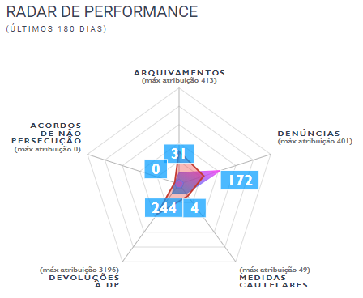

Radar de Performance
====================

.. contents:: :local:

O Radar de Performance é um componente destinado a facilitar a análise das ações que estão sendo tomadas pela promotoria, e comparar com outros órgãos de mesma atribuição. 

Os endpoints e tabelas dos Radares de Performance de PIP e Tutela são separados. Assim, eles serão tratados também em subseções separadas.

.. _radar-performance-tutela:

Radar de Performance da Tutela
------------------------------

.. figure:: figuras/radar_performance_tutela.png
   :alt: RadarTutela

User Manual
~~~~~~~~~~~

O Radar de Performance da Tutela analisa 5 eixos de ação da promotoria:

- Arquivamentos;
- Ações Civis Públicas (ACPs);
- Indeferimentos de Plano;
- Instaurações de Investigação;
- e Termos de Ajuste de Conduta (TACs).

Para cada um destes eixos temos o número total de andamentos detectados num período de 6 meses, assim como o valor máximo presente em um mesmo órgão daquela atribuição. Os andamentos não podem ter sido cancelados, e nem o documento ao qual se referem. 

O gráfico permite analisar, visualmente, quais eixos estão mais próximos do máximo, e quais estão mais próximos de 0. Além disso, é possível ver o perfil médio daquela atribuição em cada um dos eixos. Assim, pode-se comparar a promotoria em questão, com o comportamento médio dos outros órgãos similares a ela.

Nos casos em que, em um mesmo documento, mais de um andamento tenha ocorrido numa mesma data, utilizamos uma ordem de prioridade para decidir quais serão levados em consideração, e quais serão descartadas. Essa ordem de prioridade é a seguinte:

- Peso 5: Ajuizamento de Ação;
- Peso 4: TACs;
- Peso 3: Instauração;
- Peso 2: Arquivamento;
- Peso 1: Indeferimento.

Por exemplo, caso, em um dado dia, um documento tenha tido um andamento para Ajuizamento de Ação, e outro andamento de Arquivamento, apenas o andamento de Ajuizamento de Ação será contabilizado. Caso haja 2 ajuizamentos de ação, apenas será contado 1.

No entanto, se esses andamentos ocorrerem em dia distintos, eles serão contabilizados. No mesmo exemplo, caso o dia do andamento de Ajuizamento de Ação fosse diferente do dia do andamento de Arquivamento, ambos seriam levados em consideração.

Um outro ponto relevante é que existem alguns tipos de andamentos que podem cancelar andamentos de determinados eixos. Por exemplo, um andamento de Cancelamento de Indeferimento pode cancelar um andamento do eixo de Indeferimento, caso ele tenha ocorrido no mesmo documento e na mesma data do Indeferimento ou em uma data posterior. Os andamentos que cancelam outros serão explicitados mais abaixo.

Os tipos de andamento considerados em cada um dos 5 eixos são os seguintes:

Regras de Arquivamento
**********************

+-----------------------------------+-----------------------------------+
| tppr_dk                           | hierarquia                        |
+===================================+===================================+
| 6015                              | MEMBRO > Arquivamento > Com       |
|                                   | remessa ao Conselho Superior >    |
|                                   | Integral sem TAC (Tutela          |
|                                   | individual)                       |
+-----------------------------------+-----------------------------------+
| 6016                              | MEMBRO > Arquivamento > Com       |
|                                   | remessa ao Conselho Superior >    |
|                                   | Parcial (Tutela individual)       |
+-----------------------------------+-----------------------------------+
| 6017                              | MEMBRO > Arquivamento > Com       |
|                                   | remessa ao Poder Judiciário >     |
|                                   | Integral > Extinção da            |
|                                   | Punibilidade por Outros           |
|                                   | Fundamentos                       |
+-----------------------------------+-----------------------------------+
| 6018                              | MEMBRO > Arquivamento > Com       |
|                                   | remessa ao Poder Judiciário >     |
|                                   | Integral > Ausência/Insuficiência |
|                                   | de Provas (Falta de Suporte       |
|                                   | Fático Probatório)                |
+-----------------------------------+-----------------------------------+
| 6019                              | MEMBRO > Arquivamento > Com       |
|                                   | remessa ao Poder Judiciário >     |
|                                   | Integral > Em razão de o          |
|                                   | adolescente ter alcançado a       |
|                                   | maioridade penal                  |
+-----------------------------------+-----------------------------------+
| 6020                              | MEMBRO > Arquivamento > Com       |
|                                   | remessa ao Poder Judiciário >     |
|                                   | Parcial > Extinção da             |
|                                   | Punibilidade por Outros           |
|                                   | Fundamentos                       |
+-----------------------------------+-----------------------------------+
| 6021                              | MEMBRO > Arquivamento > Com       |
|                                   | remessa ao Poder Judiciário >     |
|                                   | Parcial > Ausência/Insuficiência  |
|                                   | de Provas (Falta de Suporte       |
|                                   | Fático Probatório)                |
+-----------------------------------+-----------------------------------+
| 6022                              | MEMBRO > Arquivamento > Com       |
|                                   | remessa ao Poder Judiciário >     |
|                                   | Parcial > Em razão de o           |
|                                   | adolescente ter alcançado a       |
|                                   | maioridade penal                  |
+-----------------------------------+-----------------------------------+
| 6324                              | MEMBRO > Arquivamento             |
+-----------------------------------+-----------------------------------+
| 6325                              | MEMBRO > Arquivamento > Com       |
|                                   | remessa ao Conselho Superior      |
+-----------------------------------+-----------------------------------+
| 6327                              | MEMBRO > Arquivamento > Com       |
|                                   | remessa ao Conselho Superior >    |
|                                   | Integral sem TAC (Tutela          |
|                                   | coletiva)                         |
+-----------------------------------+-----------------------------------+
| 6328                              | MEMBRO > Arquivamento > Com       |
|                                   | remessa ao Conselho Superior >    |
|                                   | Parcial (Tutela coletiva)         |
+-----------------------------------+-----------------------------------+
| 6329                              | MEMBRO > Arquivamento > Com       |
|                                   | remessa ao Poder Judiciário       |
+-----------------------------------+-----------------------------------+
| 6330                              | MEMBRO > Arquivamento > Com       |
|                                   | remessa ao Poder Judiciário >     |
|                                   | Parcial                           |
+-----------------------------------+-----------------------------------+
| 6331                              | MEMBRO > Arquivamento > Com       |
|                                   | remessa ao Poder Judiciário >     |
|                                   | Parcial > Desconhecimento do      |
|                                   | Autor                             |
+-----------------------------------+-----------------------------------+
| 6332                              | MEMBRO > Arquivamento > Com       |
|                                   | remessa ao Poder Judiciário >     |
|                                   | Parcial > Inexistência de Crime   |
+-----------------------------------+-----------------------------------+
| 6333                              | MEMBRO > Arquivamento > Com       |
|                                   | remessa ao Poder Judiciário >     |
|                                   | Parcial > Prescrição              |
+-----------------------------------+-----------------------------------+
| 6334                              | MEMBRO > Arquivamento > Com       |
|                                   | remessa ao Poder Judiciário >     |
|                                   | Parcial > Decadência              |
+-----------------------------------+-----------------------------------+
| 6335                              | MEMBRO > Arquivamento > Com       |
|                                   | remessa ao Poder Judiciário >     |
|                                   | Parcial > Retratação Lei Maria da |
|                                   | Penha                             |
+-----------------------------------+-----------------------------------+
| 6336                              | MEMBRO > Arquivamento > Com       |
|                                   | remessa ao Poder Judiciário >     |
|                                   | Parcial > Pagamento de Débito     |
|                                   | Tributário                        |
+-----------------------------------+-----------------------------------+
| 6337                              | MEMBRO > Arquivamento > Com       |
|                                   | remessa ao Poder Judiciário >     |
|                                   | Integral                          |
+-----------------------------------+-----------------------------------+
| 6338                              | MEMBRO > Arquivamento > Com       |
|                                   | remessa ao Poder Judiciário >     |
|                                   | Integral > Desconhecimento do     |
|                                   | Autor                             |
+-----------------------------------+-----------------------------------+
| 6339                              | MEMBRO > Arquivamento > Com       |
|                                   | remessa ao Poder Judiciário >     |
|                                   | Integral > Inexistência de Crime  |
+-----------------------------------+-----------------------------------+
| 6340                              | MEMBRO > Arquivamento > Com       |
|                                   | remessa ao Poder Judiciário >     |
|                                   | Integral > Prescrição             |
+-----------------------------------+-----------------------------------+
| 6341                              | MEMBRO > Arquivamento > Com       |
|                                   | remessa ao Poder Judiciário >     |
|                                   | Integral > Decadência             |
+-----------------------------------+-----------------------------------+
| 6342                              | MEMBRO > Arquivamento > Com       |
|                                   | remessa ao Poder Judiciário >     |
|                                   | Integral > Retratação Lei Maria   |
|                                   | da Penha                          |
+-----------------------------------+-----------------------------------+
| 6343                              | MEMBRO > Arquivamento > Com       |
|                                   | remessa ao Poder Judiciário >     |
|                                   | Integral > Pagamento de Débito    |
|                                   | Tributário                        |
+-----------------------------------+-----------------------------------+
| 6344                              | MEMBRO > Arquivamento > Sem       |
|                                   | remessa ao Conselho               |
|                                   | Superior/Câmara                   |
+-----------------------------------+-----------------------------------+
| 6345                              | MEMBRO > Arquivamento > Sem       |
|                                   | remessa ao Conselho               |
|                                   | Superior/Câmara > Parcial         |
+-----------------------------------+-----------------------------------+
| 6346                              | MEMBRO > Arquivamento > Sem       |
|                                   | remessa ao Conselho               |
|                                   | Superior/Câmara > Integral        |
+-----------------------------------+-----------------------------------+
| 6548                              | MEMBRO > Termo de reconhecimento  |
|                                   | de paternidade                    |
+-----------------------------------+-----------------------------------+
| 6553                              | MEMBRO > Arquivamento > Com       |
|                                   | remessa ao Poder Judiciário >     |
|                                   | Integral > Insuficiência de       |
|                                   | Provas                            |
+-----------------------------------+-----------------------------------+
| 6591                              | MEMBRO > Arquivamento > Com       |
|                                   | remessa ao Poder Judiciário >     |
|                                   | Integral > Falta de condições     |
|                                   | para o regular exercício do       |
|                                   | direito de ação                   |
+-----------------------------------+-----------------------------------+
| 6593                              | MEMBRO > Arquivamento > Com       |
|                                   | remessa ao Poder Judiciário >     |
|                                   | Parcial > Falta de condições para |
|                                   | o exercício do direito de ação    |
+-----------------------------------+-----------------------------------+
| 6644                              | MEMBRO > Arquivamento > Com       |
|                                   | remessa ao Conselho Superior >    |
|                                   | Integral sem TAC (Tutela          |
|                                   | coletiva) > Resolução da questão  |
+-----------------------------------+-----------------------------------+
| 6645                              | MEMBRO > Arquivamento > Com       |
|                                   | remessa ao Conselho Superior >    |
|                                   | Integral sem TAC (Tutela          |
|                                   | coletiva) > Por Outros Motivos >  |
|                                   | Não configuração de ilícito       |
+-----------------------------------+-----------------------------------+
| 6656                              | MEMBRO > Arquivamento > Com       |
|                                   | remessa ao Conselho Superior >    |
|                                   | Parcial (Tutela coletiva) > Sem   |
|                                   | TAC                               |
+-----------------------------------+-----------------------------------+
| 6657                              | MEMBRO > Arquivamento > Com       |
|                                   | remessa ao Conselho Superior >    |
|                                   | Parcial (Tutela coletiva) > Sem   |
|                                   | TAC > Resolução da questão        |
+-----------------------------------+-----------------------------------+
| 6658                              | MEMBRO > Arquivamento > Com       |
|                                   | remessa ao Conselho Superior >    |
|                                   | Parcial (Tutela coletiva) > Sem   |
|                                   | TAC > Por Outros Motivos > Não    |
|                                   | configuração de ilícito           |
+-----------------------------------+-----------------------------------+
| 6659                              | MEMBRO > Arquivamento > Com       |
|                                   | remessa ao Conselho Superior >    |
|                                   | Parcial (Tutela coletiva) > Sem   |
|                                   | TAC > Por Outros Motivos >        |
|                                   | Inveracidade do fato              |
+-----------------------------------+-----------------------------------+
| 6660                              | MEMBRO > Arquivamento > Com       |
|                                   | remessa ao Conselho Superior >    |
|                                   | Parcial (Tutela coletiva) > Sem   |
|                                   | TAC > Por Outros Motivos >        |
|                                   | Prescrição                        |
+-----------------------------------+-----------------------------------+
| 6661                              | MEMBRO > Arquivamento > Com       |
|                                   | remessa ao Conselho Superior >    |
|                                   | Parcial (Tutela coletiva) > Sem   |
|                                   | TAC > Por Outros Motivos > Perda  |
|                                   | do objeto sem resolução da        |
|                                   | questão                           |
+-----------------------------------+-----------------------------------+
| 6662                              | MEMBRO > Arquivamento > Com       |
|                                   | remessa ao Conselho Superior >    |
|                                   | Parcial (Tutela coletiva) > Sem   |
|                                   | TAC > Por Outros Motivos > Falta  |
|                                   | de uma das condições da ação      |
+-----------------------------------+-----------------------------------+
| 6663                              | MEMBRO > Arquivamento > Com       |
|                                   | remessa ao Conselho Superior >    |
|                                   | Parcial (Tutela coletiva) > Sem   |
|                                   | TAC > Por Outros Motivos > Outros |
+-----------------------------------+-----------------------------------+
| 6664                              | MEMBRO > Arquivamento > Com       |
|                                   | remessa ao Conselho Superior >    |
|                                   | Integral sem TAC (Tutela          |
|                                   | individual) > Resolução da        |
|                                   | questão                           |
+-----------------------------------+-----------------------------------+
| 6665                              | MEMBRO > Arquivamento > Com       |
|                                   | remessa ao Conselho Superior >    |
|                                   | Integral sem TAC (Tutela          |
|                                   | individual) > Não configuração de |
|                                   | ilícito                           |
+-----------------------------------+-----------------------------------+
| 6666                              | MEMBRO > Arquivamento > Com       |
|                                   | remessa ao Conselho Superior >    |
|                                   | Integral sem TAC (Tutela          |
|                                   | individual) > Inveracidade do     |
|                                   | fato                              |
+-----------------------------------+-----------------------------------+
| 6667                              | MEMBRO > Arquivamento > Com       |
|                                   | remessa ao Conselho Superior >    |
|                                   | Integral sem TAC (Tutela          |
|                                   | individual) > Perda do objeto sem |
|                                   | resolução da questão              |
+-----------------------------------+-----------------------------------+
| 6668                              | MEMBRO > Arquivamento > Com       |
|                                   | remessa ao Conselho Superior >    |
|                                   | Integral sem TAC (Tutela          |
|                                   | individual) > Falta de uma das    |
|                                   | condições da ação                 |
+-----------------------------------+-----------------------------------+
| 6669                              | MEMBRO > Arquivamento > Com       |
|                                   | remessa ao Conselho Superior >    |
|                                   | Integral sem TAC (Tutela          |
|                                   | individual) > Outros              |
+-----------------------------------+-----------------------------------+
| 6670                              | MEMBRO > Arquivamento > Com       |
|                                   | remessa ao Conselho Superior >    |
|                                   | Parcial (Tutela individual) > Com |
|                                   | TAC                               |
+-----------------------------------+-----------------------------------+
| 6671                              | MEMBRO > Arquivamento > Com       |
|                                   | remessa ao Conselho Superior >    |
|                                   | Parcial (Tutela individual) > Sem |
|                                   | TAC                               |
+-----------------------------------+-----------------------------------+
| 6672                              | MEMBRO > Arquivamento > Com       |
|                                   | remessa ao Conselho Superior >    |
|                                   | Parcial (Tutela individual) > Sem |
|                                   | TAC > Resolução da questão        |
+-----------------------------------+-----------------------------------+
| 6673                              | MEMBRO > Arquivamento > Com       |
|                                   | remessa ao Conselho Superior >    |
|                                   | Parcial (Tutela individual) > Sem |
|                                   | TAC > Não configuração de ilícito |
+-----------------------------------+-----------------------------------+
| 6674                              | MEMBRO > Arquivamento > Com       |
|                                   | remessa ao Conselho Superior >    |
|                                   | Parcial (Tutela individual) > Sem |
|                                   | TAC > Inveracidade do fato        |
+-----------------------------------+-----------------------------------+
| 6675                              | MEMBRO > Arquivamento > Com       |
|                                   | remessa ao Conselho Superior >    |
|                                   | Parcial (Tutela individual) > Sem |
|                                   | TAC > Perda do objeto sem         |
|                                   | resolução da questão              |
+-----------------------------------+-----------------------------------+
| 6676                              | MEMBRO > Arquivamento > Com       |
|                                   | remessa ao Conselho Superior >    |
|                                   | Parcial (Tutela individual) > Sem |
|                                   | TAC > Falta de uma das condições  |
|                                   | da ação                           |
+-----------------------------------+-----------------------------------+
| 6677                              | MEMBRO > Arquivamento > Com       |
|                                   | remessa ao Conselho Superior >    |
|                                   | Parcial (Tutela individual) > Sem |
|                                   | TAC > Outros                      |
+-----------------------------------+-----------------------------------+
| 6678                              | MEMBRO > Arquivamento > Com       |
|                                   | remessa ao Conselho Superior >    |
|                                   | Integral sem TAC (Tutela          |
|                                   | coletiva) > Por Outros Motivos >  |
|                                   | Inveracidade do fato              |
+-----------------------------------+-----------------------------------+
| 6679                              | MEMBRO > Arquivamento > Com       |
|                                   | remessa ao Conselho Superior >    |
|                                   | Integral sem TAC (Tutela          |
|                                   | coletiva) > Por Outros Motivos >  |
|                                   | Prescrição                        |
+-----------------------------------+-----------------------------------+
| 6680                              | MEMBRO > Arquivamento > Com       |
|                                   | remessa ao Conselho Superior >    |
|                                   | Integral sem TAC (Tutela          |
|                                   | coletiva) > Por Outros Motivos >  |
|                                   | Perda do objeto sem resolução da  |
|                                   | questão                           |
+-----------------------------------+-----------------------------------+
| 6681                              | MEMBRO > Arquivamento > Com       |
|                                   | remessa ao Conselho Superior >    |
|                                   | Integral sem TAC (Tutela          |
|                                   | coletiva) > Por Outros Motivos >  |
|                                   | Falta de uma das condições da     |
|                                   | ação                              |
+-----------------------------------+-----------------------------------+
| 6682                              | MEMBRO > Arquivamento > Com       |
|                                   | remessa ao Conselho Superior >    |
|                                   | Integral sem TAC (Tutela          |
|                                   | coletiva) > Por Outros Motivos >  |
|                                   | Outros                            |
+-----------------------------------+-----------------------------------+
| 7745                              | MEMBRO > Arquivamento > De        |
|                                   | notícia de fato ou procedimento   |
|                                   | de atribuição originária do PGJ   |
+-----------------------------------+-----------------------------------+
| 7834                              | MEMBRO > Indeferimento de pedido  |
|                                   | de desarquivamento                |
+-----------------------------------+-----------------------------------+
| 7869                              | MEMBRO > Arquivamento > Com       |
|                                   | remessa ao Conselho Superior >    |
|                                   | Integral sem TAC (Tutela          |
|                                   | coletiva) > Por Outros Motivos    |
+-----------------------------------+-----------------------------------+
| 7870                              | MEMBRO > Arquivamento > Com       |
|                                   | remessa ao Conselho Superior >    |
|                                   | Parcial (Tutela coletiva) > Sem   |
|                                   | TAC > Por Outros Motivos          |
+-----------------------------------+-----------------------------------+
| 7871                              | MEMBRO > Arquivamento > Com       |
|                                   | remessa ao Poder Judiciário >     |
|                                   | Integral > Morte do Agente        |
+-----------------------------------+-----------------------------------+
| 7872                              | MEMBRO > Arquivamento > Com       |
|                                   | remessa ao Poder Judiciário >     |
|                                   | Parcial > Morte de Agente         |
+-----------------------------------+-----------------------------------+
| 7912                              | MEMBRO > Arquivamento > Com       |
|                                   | Remessa ao PRE/PGE                |
+-----------------------------------+-----------------------------------+

!! Adicionar 7737 e 6350?

Regras de Ações Civis Públicas
******************************

+-----------------------------------+------------------------------------------------+
| tppr_dk                           | hierarquia                                     |
+===================================+================================================+
| 6251                              | MEMBRO > Ajuizamento de Ação > Petição Inicial |
+-----------------------------------+------------------------------------------------+

Regras de Indeferimentos de Plano
*********************************

+-----------------------------------+-----------------------------------------+
| tppr_dk                           | hierarquia                              |
+===================================+=========================================+
| 6322                              | MEMBRO > Indeferimento de Instauração > |
|                                   | Instauração de Procedimento ou          |
|                                   | Inquérito Civil Público                 |
+-----------------------------------+-----------------------------------------+

Regras de Instaurações de Investigação
**************************************

+-----------------------------------+------------------------------------------------+
| tppr_dk                           | hierarquia                                     |
+===================================+================================================+
| 1092                              | Instauração de Procedimento administrativo     |
+-----------------------------------+------------------------------------------------+
| 1094                              | Instauração de Inquérito civil                 |
+-----------------------------------+------------------------------------------------+
| 1095                              | Instauração de Procedimento preparatório       |
+-----------------------------------+------------------------------------------------+
| 6007                              | MEMBRO > Reconsideração > Reconsideração do    |
|                                   | indeferimento de Notícia de Fato               |
+-----------------------------------+------------------------------------------------+
| 6011                              | MEMBRO > Portaria > Instauração de Procedimento|
|                                   | Preparatório                                   |
+-----------------------------------+------------------------------------------------+
| 6012                              | MEMBRO > Portaria > Instauração de Inquérito   |
|                                   | Civil                                          |
+-----------------------------------+------------------------------------------------+
| 6013                              | MEMBRO > Portaria > Instauração de Procedimento|
|                                   | Administrativo                                 |
+-----------------------------------+------------------------------------------------+

Regras de Termos de Ajuste de Conduta
*************************************

+-----------------------------------+-----------------------------------+
| tppr_dk                           | hierarquia                        |
+===================================+===================================+
| 6326                              | MEMBRO > Arquivamento > Com       |
|                                   | remessa ao Conselho Superior >    |
|                                   | Integral com TAC                  |
+-----------------------------------+-----------------------------------+
| 6655                              | MEMBRO > Arquivamento > Com       |
|                                   | remessa ao Conselho Superior >    |
|                                   | Parcial (Tutela coletiva) > Com   |
|                                   | TAC                               |
+-----------------------------------+-----------------------------------+

Regras de Cancelamentos de Andamento
************************************

Os seguintes andamentos servem para cancelar outros. É relevante notar que o andamento de Indeferimento, ao mesmo tempo em que cancela uma Instauração que tenha ocorrido anteriormente, também irá adicionar à contagem do eixo de Indeferimento. Da mesma forma, o andamento de Reconsideração do Indeferimento também é usado para somar no eixo de Instauração, ao mesmo tempo em que tira da contagem Indeferimentos feitos anteriormente.

Outro ponto importante é que os andamentos de desarquivamento podem ser usados para cancelar a contagem de andamentos tanto no eixo de Ação, quanto de TACs ou Arquivamentos, e não apenas no eixo de Desarquivamento.

Andamentos que cancelam instaurações:

+-----------------------------------+-----------------------------------------+
| tppr_dk                           | hierarquia                              |
+===================================+=========================================+
| 6322                              | MEMBRO > Indeferimento de Instauração > |
|                                   | Instauração de Procedimento ou          |
|                                   | Inquérito Civil Público                 |
+-----------------------------------+-----------------------------------------+

Andamentos que cancelam indeferimentos:

+-----------------------------------+------------------------------------------------+
| tppr_dk                           | hierarquia                                     |
+===================================+================================================+
| 6007                              | MEMBRO > Reconsideração > Reconsideração do    |
|                                   | indeferimento de Notícia de Fato               |
+-----------------------------------+------------------------------------------------+

Andamentos que cancelam arquivamentos, TACs ou ACPs:

+-----------------------------------+---------------------------------------------------------+
| tppr_dk                           | hierarquia                                              |
+===================================+=========================================================+
| 1027                              | Promoção de desarquivamento em virtude de novas provas  |
|                                   | por decisão do Conselho Superior do MPRJ                |
+-----------------------------------+---------------------------------------------------------+
| 1028                              | Desarquivamento                                         |
+-----------------------------------+---------------------------------------------------------+
| 6003                              | MEMBRO > Desarquivamento (em virtude de novas provas) > |
|                                   | Por decisão do Conselho Superior do MPRJ                |
+-----------------------------------+---------------------------------------------------------+
| 6004                              | MEMBRO > Desarquivamento (em virtude de novas provas) > |
|                                   | Promoção de desarquivamento de inquérito policial ou de |
|                                   | ou de auto de investigação por ato infracional          |
+-----------------------------------+---------------------------------------------------------+
| 6075                              | MEMBRO > Área Administrativa/CGMP > Desarquivamento     |
+-----------------------------------+---------------------------------------------------------+
| 6307                              | MEMBRO > Desarquivamento (em virtude de novas provas)   |
+-----------------------------------+---------------------------------------------------------+
| 6696                              | MEMBRO > Desarquivamento (em virtude de novas provas) > |
|                                   | Promoção de desarquivamento de Representação ou de      |
|                                   | Peças de Informação                                     |
+-----------------------------------+---------------------------------------------------------+
| 6798                              | MEMBRO > ATOS COMUNS > Desarquivamento                  |
+-----------------------------------+---------------------------------------------------------+
| 7245                              | SERVIDOR > ATOS COMUNS > Desarquivamento                |
+-----------------------------------+---------------------------------------------------------+
| 7801                              | MEMBRO > Desarquivamento (em virtude de novas provas) > |
|                                   | Por decisão do Procurador-Geral de Justiça              |
+-----------------------------------+---------------------------------------------------------+
| 7802                              | MEMBRO > Desarquivamento (em virtude de novas provas) > |
|                                   | Sem remessa ao PGJ ou ao CSMP                           |
+-----------------------------------+---------------------------------------------------------+
| 7803                              | MEMBRO > Requerimento de desarquivamento ao PGJ ou ao   |
|                                   | CSMP                                                    |
+-----------------------------------+---------------------------------------------------------+

Estrutura do Código
~~~~~~~~~~~~~~~~~~~

Processo BDA
************

::

   Nome da Tabela: TB_RADAR_PERFORMANCE
   Colunas: 
        cod_pct (int)
        pacote_atribuicao (string)
        orgao_id (int)
        nr_arquivamentos (int)
        nr_indeferimentos (int)
        nr_instauracoes (int)
        nr_tac (int)
        nr_acoes (int)
        max_pacote_arquivamentos (int)
        max_pacote_indeferimentos (int)
        max_pacote_instauracoes (int)
        max_pacote_tac (int)
        max_pacote_acoes (int)
        perc_arquivamentos (double)
        perc_indeferimentos (double)
        perc_instauracoes (double)
        perc_tac (double)
        perc_acoes (double)
        med_pacote_aquivamentos (double)
        med_pacote_indeferimentos (double)
        med_pacote_instauracoes (double)
        med_pacote_tac (double)
        med_pacote_acoes (double)
        var_med_arquivaentos (double)
        var_med_indeferimentos (double)
        var_med_instauracoes (double)
        var_med_tac (double)
        var_med_acoes (double)
        dt_calculo (timestamp)
        nm_max_arquivamentos (string)
        nm_max_indeferimentos (string)
        nm_max_instauracoes (string)
        nm_max_tac (string)
        nm_max_acoes (string)

!! Há um erro de digitação na coluna "var_med_arquivaentos" na tabela no banco. Não afeta a operação, mas bom deixar registrado que precisa ser consertado.

O script de criação das tabelas irá filtrar os andamentos que ocorreram nos últimos 180 dias correntes, que não foram cancelados e cujo documento não tenha sido cancelado, e que possuam qualquer um dos tipos determinados nas regras de negócio da subseção anterior.

Também são considerados alguns andamentos "canceladores", ou seja, que anulam os andamentos de determinados eixos. Eles estão definidos na seção anterior.

Com os andamentos (e cancelamentos) definidos, é montada uma ordem de prioridades para cada um dos cinco eixos. Isso é feito para tratar os casos em que andamentos de dois eixos diferentes possam ter sido realizados no mesmo dia no sistema, para o mesmo documento no mesmo órgão. A ordem de prioridade é definida com os seguintes pesos:

- Peso 5: Ajuizamento de Ação;
- Peso 4: TACs;
- Peso 3: Instauração;
- Peso 2: Arquivamento;
- Peso 1: Indeferimento.

Em outras palavras, se, por exemplo, a promotoria tiver realizado uma TAC e um Arquivamento em um documento na mesma data, apenas a TAC será levada em consideração.

Além disso, caso um andamento cancelador daquele eixo tenha ocorrido, no mesmo documento, em uma data igual ou maior que a do andamento, ele também não será considerada. Isso quer dizer que, caso um Indeferimento seja seguido de uma Reconsideração de Indeferimento, ele não será contado.

Com as contagens de cada um dos eixos para cada órgão em mãos, os passos seguintes se tornam intuitivos. Calculam-se os seguintes campos:

Campos ``nr``
    Número de andamentos de cada eixo dentro do órgão

Campos ``max_pacote``
    Número máximo de andamentos do eixo, em um único órgão do pacote

Campos ``perc``
    O percentual relativo entre o valor do órgão naquele eixo e o máximo, por exemplo: :math:`perc\_tac = \frac{nr\_tac}{max\_pacote\_tac}`

Campos ``med_pacote``
    O valor da mediana do pacote naquele eixo

Campos ``var_med_pacote``
    A variação entre o valor do eixo no órgão e a mediana do pacote, por exemplo: :math:`var\_med\_pacote\_tac = \frac{(nr\_tac) - (med\_pacote\_tac)}{med\_pacote\_tac}`

Campos ``nm_max``
    O nome do órgão que representa o máximo do pacote naquele eixo

Os resultados são então salvos na tabela, sobrescrevendo os dados anteriores.

URL do Script: https://github.com/MinisterioPublicoRJ/scripts-bda/blob/develop/robo_promotoria/src/tabela_radar_performance.py.

View Backend
************

::

    GET /dominio/radar/<id_orgao>

    HTTP 200 OK
    Allow: GET, HEAD, OPTIONS
    Content-Type: application/json
    Vary: Accept

    {
        "cod_pct": 123,
        "pacote_atribuicao": "Tutela Coletiva",
        "orgao_id": 12345.0,
        "nr_arquivamentos": 45,
        "nr_indeferimentos": 29,
        "nr_instauracoes": 5,
        "nr_tac": 0,
        "nr_acoes": 0,
        "max_pacote_arquivamentos": 156,
        "max_pacote_indeferimentos": 99,
        "max_pacote_instauracoes": 38,
        "max_pacote_tac": 1,
        "max_pacote_acoes": 12,
        "perc_arquivamentos": 0.28846153846153844,
        "perc_indeferimentos": 0.29292929292929293,
        "perc_instauracoes": 0.13157894736842105,
        "perc_acoes": 0.0,
        "perc_tac": 0.0,
        "med_pacote_aquivamentos": 53.5,
        "med_pacote_tac": 47.0,
        "med_pacote_indeferimentos": 20.0,
        "med_pacote_instauracoes": 0.0,
        "med_pacote_acoes": 1.5,
        "var_med_arquivamentos": -0.1588785046728972,
        "var_med_tac": -0.3829787234042553,
        "var_med_indeferimentos": -0.75,
        "var_med_instauracoes": null,
        "var_med_acoes": -1.0,
        "dt_calculo": "2020-03-30T10:46:14.837000",
        "nm_max_arquivamentos": "Promotoria de Justiça 1",
        "nm_max_indeferimentos": "Promotoria de Justiça 2, Promotoria de Justiça 3",
        "nm_max_instauracoes": "Promotoria de Justiça 4",
        "nm_max_tac": "1ª Promotoria de Justiça",
        "nm_max_acoes": "4ª Promtoria de Justiça"
    }

Nome da View: `RadarView`_.

A View no Backend apenas irá consultar a tabela TB_RADAR_PERFORMANCE no BDA filtrando pelo órgão selecionado, formatando o nome das promotorias, e retornando a resposta no formato especificado acima.

.. _RadarView: https://github.com/MinisterioPublicoRJ/apimpmapas/blob/documentacao/doc_promotron/dominio/tutela/radar_views.py

Dependências
~~~~~~~~~~~~

- Tabelas do Exadata
- :ref:`tabelas-auxiliares-atualizacao-pj-pacote`

Troubleshooting
~~~~~~~~~~~~~~~

- Verificar que a resposta está vindo para o Front. Caso não esteja, verificar se a tabela TB_RADAR_PERFORMANCE possui dados para o órgão em questão.
- Se a tabela possuir dados para o órgão, o problema provavelmente está no backend.
- Caso a tabela não possua dados para o dado órgão, verificar que ele possui pacote de atribuição definido na tabela :ref:`tabelas-auxiliares-atualizacao-pj-pacote`.
- Caso possua, verificar se o órgão tem andamentos nos últimos 180 dias nas tabelas do Exadata.

Radar de Performance da PIP
---------------------------

User Manual
~~~~~~~~~~~

O Radar de Performance da PIP analisa 5 eixos de ação da promotoria:

- Arquivamentos;
- Denúncias;
- Medidas Cautelares;
- Devoluções à DP;
- e Acordos de Não-Persecução.

Para cada um destes eixos temos o número total de andamentos detectados num período de 6 meses, assim como o valor máximo presente em um mesmo órgão daquela atribuição. Os andamentos não podem ter sido cancelados, e nem o documento ao qual se referem.

O único eixo em que isso não se aplica, é o eixo de "devoluções à DP", que não leva em consideração diretamente tipos de andamento, mas sim vistas.

Diferentemente do :ref:`radar-performance-tutela` (que considera documentos de qualquer classe), o Radar de Performance da PIP está restrito a um certo conjunto de documentos:

+-----------------------------------+-----------------------------------+
| cldc_dk                           | hierarquia                        |
+===================================+===================================+
| 3                                 | PROCESSO MILITAR > PROCESSO       |
|                                   | CRIMINAL > Procedimentos          |
|                                   | Investigatórios > Inquérito       |
|                                   | Policial Militar                  |
+-----------------------------------+-----------------------------------+
| 494                               | PROCESSO CRIMINAL > Procedimentos |
|                                   | Investigatórios > Inquérito       |
|                                   | Policial                          |
+-----------------------------------+-----------------------------------+
| 590                               | PROCESSO CRIMINAL > Procedimentos |
|                                   | Investigatórios > Procedimento    |
|                                   | Investigatório Criminal (PIC-MP)  |
+-----------------------------------+-----------------------------------+

Isso quer dizer que, caso um andamento de denúncia, por exemplo, tenha ocorrido em um documento que não pertença a alguma destas classes, ele não será contabilizado no radar.

O gráfico permite analisar, visualmente, quais eixos estão mais próximos do máximo, e quais estão mais próximos de 0. Além disso, é possível ver o perfil médio daquela atribuição em cada um dos eixos. Assim, pode-se comparar a promotoria em questão, com o comportamento médio dos outros órgãos similares a ela.

Outra diferença em relação ao radar de tutela é que, neste caso, não há uma ordem de prioridade para eixos que ocorram na mesma data. Assim, caso um andamento de denúncia ocorrer conjuntamente com um andamento de medida cautelar, ambos serão contabilizados. A exceção é quando dois andamentos do mesmo eixo ocorrem ao mesmo tempo. Então, caso 2 denúncias ou 2 medidas cautelares sejam feitas na mesma data, apenas 1 será contada em cada eixo.

Os tipos de andamento considerados em cada um dos 5 eixos são os seguintes:

Regras de Arquivamento
**********************

+------+--------------------------------------------------------------------------------------------------------------------------------------------+
| id   | hierarquia                                                                                                                                 |
+======+============================================================================================================================================+
| 6017 | MEMBRO > Arquivamento > Com remessa ao Poder Judiciário > Integral > Extinção da Punibilidade por Outros Fundamentos                       |
+------+--------------------------------------------------------------------------------------------------------------------------------------------+
| 6018 | MEMBRO > Arquivamento > Com remessa ao Poder Judiciário > Integral > Ausência/Insuficiência de Provas (Falta de Suporte Fático Probatório) |
+------+--------------------------------------------------------------------------------------------------------------------------------------------+
| 6020 | MEMBRO > Arquivamento > Com remessa ao Poder Judiciário > Parcial > Extinção da Punibilidade por Outros Fundamentos                        |
+------+--------------------------------------------------------------------------------------------------------------------------------------------+
| 6338 | MEMBRO > Arquivamento > Com remessa ao Poder Judiciário > Integral > Desconhecimento do Autor                                              |
+------+--------------------------------------------------------------------------------------------------------------------------------------------+
| 6339 | MEMBRO > Arquivamento > Com remessa ao Poder Judiciário > Integral > Inexistência de Crime                                                 |
+------+--------------------------------------------------------------------------------------------------------------------------------------------+
| 6340 | MEMBRO > Arquivamento > Com remessa ao Poder Judiciário > Integral > Prescrição                                                            |
+------+--------------------------------------------------------------------------------------------------------------------------------------------+
| 6341 | MEMBRO > Arquivamento > Com remessa ao Poder Judiciário > Integral > Decadência                                                            |
+------+--------------------------------------------------------------------------------------------------------------------------------------------+
| 6342 | MEMBRO > Arquivamento > Com remessa ao Poder Judiciário > Integral > Retratação Lei Maria da Penha                                         |
+------+--------------------------------------------------------------------------------------------------------------------------------------------+
| 6343 | MEMBRO > Arquivamento > Com remessa ao Poder Judiciário > Integral > Pagamento de Débito Tributário                                        |
+------+--------------------------------------------------------------------------------------------------------------------------------------------+
| 6346 | MEMBRO > Arquivamento > Sem remessa ao Conselho Superior/Câmara > Integral                                                                 |
+------+--------------------------------------------------------------------------------------------------------------------------------------------+
| 6350 | MEMBRO > Homologação de Arquivamento                                                                                                       |
+------+--------------------------------------------------------------------------------------------------------------------------------------------+
| 6359 | MEMBRO > Decisão Artigo 28 CPP / 397 CPPM > Confirmação Integral > Arquivamento                                                            |
+------+--------------------------------------------------------------------------------------------------------------------------------------------+
| 6392 | MEMBRO > Ciência > Arquivamento                                                                                                            |
+------+--------------------------------------------------------------------------------------------------------------------------------------------+
| 6549 | MEMBRO > Arquivamento > Com remessa ao Centro de Apoio Operacional das Promotorias Eleitorais CAO Eleitoral (EN 30-CSMP)                   |
+------+--------------------------------------------------------------------------------------------------------------------------------------------+
| 6591 | MEMBRO > Arquivamento > Com remessa ao Poder Judiciário > Integral > Falta de condições para o regular exercício do direito de ação        |
+------+--------------------------------------------------------------------------------------------------------------------------------------------+
| 6593 | MEMBRO > Arquivamento > Com remessa ao Poder Judiciário > Parcial > Falta de condições para o exercício do direito de ação                 |
+------+--------------------------------------------------------------------------------------------------------------------------------------------+
| 7745 | MEMBRO > Arquivamento > De notícia de fato ou procedimento de atribuição originária do PGJ                                                 |
+------+--------------------------------------------------------------------------------------------------------------------------------------------+
| 7871 | MEMBRO > Arquivamento > Com remessa ao Poder Judiciário > Integral > Morte do Agente                                                       |
+------+--------------------------------------------------------------------------------------------------------------------------------------------+
| 7897 | MEMBRO > Decisão Artigo 28 CPP / 397 CPPM > Confirmação Parcial > Arquivamento                                                             |
+------+--------------------------------------------------------------------------------------------------------------------------------------------+
| 7912 | MEMBRO > Arquivamento > Com Remessa ao PRE/PGE                                                                                             |
+------+--------------------------------------------------------------------------------------------------------------------------------------------+

Regras de Denúncia
******************

+------+---------------------------------------------------+
| id   | hierarquia                                        |
+======+===================================================+
| 1201 | Oferecimento de denúncia                          |
+------+---------------------------------------------------+
| 1202 | Oferecimento de denúncia com pedido de prisão     |
+------+---------------------------------------------------+
| 6252 | MEMBRO > Ajuizamento de Ação > Denúncia           |
+------+---------------------------------------------------+
| 6253 | MEMBRO > Ajuizamento de Ação > Denúncia > Escrita |
+------+---------------------------------------------------+
| 6254 | MEMBRO > Ajuizamento de Ação > Denúncia > Oral    |
+------+---------------------------------------------------+

Regras de Medida Cautelar
*************************

+------+---------------------------------------------------------------------------------------------------------------------------------------------------------------------+
| id   | hierarquia                                                                                                                                                          |
+======+=====================================================================================================================================================================+
| 1030 | Propositura de medida cautelar autônoma                                                                                                                             |
+------+---------------------------------------------------------------------------------------------------------------------------------------------------------------------+
| 1208 | Manifestação em medida cautelar requerida pela autoridade policial                                                                                                  |
+------+---------------------------------------------------------------------------------------------------------------------------------------------------------------------+
| 6038 | MEMBRO > Medida Incidental (cautelar) > Requerimento de Medida Cautelar de Interceptação Telefônica                                                                 |
+------+---------------------------------------------------------------------------------------------------------------------------------------------------------------------+
| 6039 | MEMBRO > Medida Incidental (cautelar) > Requerimento de Medida Cautelar de Interceptação de Dados Telemáticos                                                       |
+------+---------------------------------------------------------------------------------------------------------------------------------------------------------------------+
| 6040 | MEMBRO > Medida Incidental (cautelar) > Requerimento de Medida Cautelar de Obtenção de Dados Cadastrais                                                             |
+------+---------------------------------------------------------------------------------------------------------------------------------------------------------------------+
| 6041 | MEMBRO > Medida Incidental (cautelar) > Requerimento de Medida Cautelar de Quebra de Sigilo Bancário                                                                |
+------+---------------------------------------------------------------------------------------------------------------------------------------------------------------------+
| 6042 | MEMBRO > Medida Incidental (cautelar) > Requerimento de Medida Cautelar de Quebra de Sigilo Fiscal                                                                  |
+------+---------------------------------------------------------------------------------------------------------------------------------------------------------------------+
| 6043 | MEMBRO > Medida Incidental (cautelar) > Outros Requerimentos de Natureza Cautelar                                                                                   |
+------+---------------------------------------------------------------------------------------------------------------------------------------------------------------------+
| 6257 | MEMBRO > Medida Incidental (cautelar)                                                                                                                               |
+------+---------------------------------------------------------------------------------------------------------------------------------------------------------------------+
| 6258 | MEMBRO > Medida Incidental (cautelar) > Requerimento de Medida Protetiva                                                                                            |
+------+---------------------------------------------------------------------------------------------------------------------------------------------------------------------+
| 6367 | MEMBRO > Requerimento de Prisão > Preventiva > Preventiva - Art. 312 CPP                                                                                            |
+------+---------------------------------------------------------------------------------------------------------------------------------------------------------------------+
| 6368 | MEMBRO > Requerimento de Prisão > Preventiva > Preventiva - Art. 366 CPP                                                                                            |
+------+---------------------------------------------------------------------------------------------------------------------------------------------------------------------+
| 6369 | MEMBRO > Requerimento de Prisão > Preventiva > Preventiva - Art. 255 CPPM                                                                                           |
+------+---------------------------------------------------------------------------------------------------------------------------------------------------------------------+
| 6370 | MEMBRO > Requerimento de Prisão > Temporária                                                                                                                        |
+------+---------------------------------------------------------------------------------------------------------------------------------------------------------------------+
| 6620 | MEMBRO > Requerimento de Prisão > Preventiva > Preventiva - Art. 310, II, CPP (conversão)                                                                           |
+------+---------------------------------------------------------------------------------------------------------------------------------------------------------------------+
| 6648 | MEMBRO > Ajuizamento de Ação > Requerimento de Outras Medidas Cautelares (Não Incidentais)                                                                          |
+------+---------------------------------------------------------------------------------------------------------------------------------------------------------------------+
| 6649 | MEMBRO > Ajuizamento de Ação > Requerimento de Outras Medidas Cautelares (Não Incidentais) > Requerimento de Medida Cautelar de Interceptação Telefônica            |
+------+---------------------------------------------------------------------------------------------------------------------------------------------------------------------+
| 6650 | MEMBRO > Ajuizamento de Ação > Requerimento de Outras Medidas Cautelares (Não Incidentais) > Requerimento de Medida Cautelar de Interceptação de Dados Telemáticos  |
+------+---------------------------------------------------------------------------------------------------------------------------------------------------------------------+
| 6651 | MEMBRO > Ajuizamento de Ação > Requerimento de Outras Medidas Cautelares (Não Incidentais) > Requerimento de Medida Cautelar de Obtenção de Dados Cadastrais        |
+------+---------------------------------------------------------------------------------------------------------------------------------------------------------------------+
| 6652 | MEMBRO > Ajuizamento de Ação > Requerimento de Outras Medidas Cautelares (Não Incidentais) > Requerimento de Medida Cautelar de Quebra de Sigilo Bancário           |
+------+---------------------------------------------------------------------------------------------------------------------------------------------------------------------+
| 6653 | MEMBRO > Ajuizamento de Ação > Requerimento de Outras Medidas Cautelares (Não Incidentais) > Requerimento de Medida Cautelar de Quebra de Sigilo Fiscal             |
+------+---------------------------------------------------------------------------------------------------------------------------------------------------------------------+
| 6654 | MEMBRO > Ajuizamento de Ação > Requerimento de Outras Medidas Cautelares (Não Incidentais) > Outros Requerimentos de Natureza Cautelar  (não incidentais)           |
+------+---------------------------------------------------------------------------------------------------------------------------------------------------------------------+
| 7815 | MEMBRO > Medida Incidental (cautelar) > Requerimento de Medida Cautelar de Busca e Apreensão                                                                        |
+------+---------------------------------------------------------------------------------------------------------------------------------------------------------------------+
| 7816 | MEMBRO > Ajuizamento de Ação > Requerimento de Outras Medidas Cautelares (Não Incidentais) > Requerimento de Medida Cautelar de Busca e Apreensão                   |
+------+---------------------------------------------------------------------------------------------------------------------------------------------------------------------+
| 7877 | MEMBRO > Medida Incidental (cautelar) > Requerimento de Medida Cautelar do Art. 319 CPP                                                                             |
+------+---------------------------------------------------------------------------------------------------------------------------------------------------------------------+
| 7878 | MEMBRO > Ajuizamento de Ação > Requerimento de Outras Medidas Cautelares (Não Incidentais) > Requerimento de Medida Cautelar do Art. 319 CPP                        |
+------+---------------------------------------------------------------------------------------------------------------------------------------------------------------------+

Regras de Devoluções à DP
*************************

O eixo de baixas à DP não possui andamentos específicos dele. Na verdade, ele é calculado a partir das vistas que não tiveram andamentos considerados importantes. Os andamentos importantes são, basicamente, todos os andamentos listados nas outras subseções aqui (ou seja, arquivamentos, denúncias, cautelares, acordos, e também os andamentos de cancelamento).

Assim, caso uma vista não tenha tido um andamento, ou se ela tiver tido apenas andamentos considerados não-importantes, ela será considerada na contagem do eixo de baixa à DP.

Exemplo: A vista 1 não possui andamento associado. Já a vista 2 possui um único andamento, de Encaminhamento ao Membro. E a vista 3 possui um Encaminhamento ao Membro e uma Denúncia. A vista 1 e 2 serão contadas como baixas à DP; a vista 3, não.

É importante notar também que, para a contagem dos outros eixos, só consideramos os andamentos que ocorreram nos últimos 180 dias, enquanto que, para a baixa à DP, esse filtro é aplicado à data de abertura da vista (e não a data do andamento). Ou seja, uma vista que tenha sido aberta antes destes 180 dias, será eliminada deste cálculo, mesmo que seu andamento tenha ocorrido dentro do intervalo.

Exemplo: A vista 1 foi aberta há 181 dias e possui um andamento de Denúncia há 179 dias. A vista 2 foi aberta também há 181 dias, e possui um Encaminhamento ao Membro há 179 dias. Já a vista 3 foi aberta há 179 dias, e possui um Encaminhamento ao Membro apenas. Neste caso, apenas a vista 3 será contabilizada como baixa à DP. Já no eixo de Denúncias, a Denúncia da vista 1 será contabilizada (já que, embora a data de abertura seja anterior ao intervalo, a data do andamento não é).

Regras de Acordo de Não-Persecução Penal
****************************************

+------+------------------------------------------------------------------+
| id   | hierarquia                                                       |
+======+==================================================================+
| 7827 | MEMBRO > Despacho > Acordo Extrajudicial                         |
+------+------------------------------------------------------------------+
| 7883 | MEMBRO > Acordo de Não Persecução Penal > Celebração de acordo   |
+------+------------------------------------------------------------------+
| 7914 | MEMBRO > Acordo de Não Persecução Penal                          |
+------+------------------------------------------------------------------+
| 7928 | MEMBRO > Ciência > Homologação de Acordo de Não Persecução Penal |
+------+------------------------------------------------------------------+

Regras de Cancelamento
**********************

Além das regras para contabilizar andamentos de cada eixo, existem algumas regras de andamentos que cancelam outros. Por exemplo, caso um andamento de rescição de acordo ocorra na mesma data ou em data posterior a um andamento de acordo, este será desconsiderado da contagem no eixo.

Andamentos que cancelam acordos:

+------+-------------------------------------------------------------------------+
| id   | hierarquia                                                              |
+======+=========================================================================+
| 7920 | MEMBRO > Manifestação > Pela rescisão do Acordo de Não Persecução Penal |
+------+-------------------------------------------------------------------------+

Andamentos que cancelam arquivamentos (obs.: no radar de tutela, os desarquivamentos cancelam tanto arquivamentos quanto TACs e ajuizamentos de ação - na PIP, eles cancelam apenas arquivamentos, não cancelando nenhum dos outros eixos):

+------+----------------------------------------------------------------------------------------------------+
| id   | hierarquia                                                                                         |
+======+====================================================================================================+
| 1027 | Promoção de desarquivamento em virtude de novas provas por decisão do Conselho Superior do MPRJ    |
+------+----------------------------------------------------------------------------------------------------+
| 1028 | Desarquivamento                                                                                    |
+------+----------------------------------------------------------------------------------------------------+
| 6003 | MEMBRO > Desarquivamento (em virtude de novas provas) > Por decisão do Conselho Superior do MPRJ   |
+------+----------------------------------------------------------------------------------------------------+
| 6075 | MEMBRO > Área Administrativa/CGMP > Desarquivamento                                                |
+------+----------------------------------------------------------------------------------------------------+
| 6307 | MEMBRO > Desarquivamento (em virtude de novas provas)                                              |
+------+----------------------------------------------------------------------------------------------------+
| 6798 | MEMBRO > ATOS COMUNS > Desarquivamento                                                             |
+------+----------------------------------------------------------------------------------------------------+
| 7245 | SERVIDOR > ATOS COMUNS > Desarquivamento                                                           |
+------+----------------------------------------------------------------------------------------------------+
| 7801 | MEMBRO > Desarquivamento (em virtude de novas provas) > Por decisão do Procurador-Geral de Justiça |
+------+----------------------------------------------------------------------------------------------------+
| 7802 | MEMBRO > Desarquivamento (em virtude de novas provas) > Sem remessa ao PGJ ou ao CSMP              |
+------+----------------------------------------------------------------------------------------------------+
| 7803 | MEMBRO > Requerimento de desarquivamento ao PGJ ou ao CSMP                                         |
+------+----------------------------------------------------------------------------------------------------+

Estrutura do Código
~~~~~~~~~~~~~~~~~~~

Processo BDA
************

::

   Nome da Tabela: TB_PIP_RADAR_PERFORMANCE
   Colunas: 
        aisp_codigo (string)
        aisp_nome (string)
        orgao_id (int)
        nr_denuncias (int)
        nr_cautelares (int)
        nr_acordos_n_persecucao (int)
        nr_arquivamentos (int)
        nr_aberturas_vista (int)
        max_denuncias (int)
        max_cautelares (int)
        max_acordos (int)
        max_arquivamentos (int)
        max_vistas (int)
        perc_denuncias (double)
        perc_cautelares (double)
        perc_acordos (double)
        perc_arquivamentos (double)
        perc_aberturas_vista (double)
        med_denuncias (double)
        med_cautelares (double)
        med_acordos (double)
        med_arquivamentos (double)
        med_vistas (double)
        var_med_denuncias (double)
        var_med_cautelares (double)
        var_med_acordos (double)
        var_med_arquivamentos (double)
        var_med_aberturas_vista (double)
        dt_calculo (timestamp)
        nm_max_denuncias (string)
        nm_max_cautelares (string)
        nm_max_acordos (string)
        nm_max_arquivamentos (string)
        nm_max_aberturas (string)
        cod_pct (int)
    
!! Apesar do campo ser salvo como "aberturas_vista", ele é referente na verdade às baixas à DP.

O script de criação das tabelas irá primeiramente filtrar as vistas de PIPs (sem andamentos ainda), cujos documentos não foram cancelados e que sejam da classe determinada nas regras de negócio. Essas vistas são mantidas numa primeira tabela temporária, e serão usadas mais tarde no cálculo das baixas à DP.

Em seguida, duas tabelas são calculadas: uma com as vistas e seus andamentos, para os andamentos considerados importantes e que tenham ocorrido no intervalo dos últimos 180 dias, e que não tenham sido cancelados. A cada andamento é atribuído um número de 1 a 4, que identifica em que eixo ele se encaixa.

Uma tabela análoga é feita para os andamentos canceladores - e o número atribuído é o oposto do eixo que ele cancela (por exemplo, os desarquivamentos estão atribuídos ao número -1, para contrapôr o 1 referente ao eixo de arquivamentos).

Assim, caso um andamento cancelador de um eixo tenha ocorrido, no mesmo documento, em uma data igual ou maior que a do andamento, essa soma será 0, o que é usado para desconsiderar determinados andamentos da contagem. Isso quer dizer que, caso um Arquivamento seja seguido de um Desarquivamento, ele não será contado. Pode-se então fazer a contagem, eliminando também possíveis duplicidades no mesmo dia (um DISTINCT é realizado para eliminar múltiplas denúncias, ou múltiplas cautelares no mesmo dia, por exemplo).

Fica faltando apenas a contagem do NR_BAIXA_DP. Esta, por sua vez, é feita juntando a tabela de andamentos importantes, com a tabela inicial de vistas, filtrando pelas vistas que possuem data de abertura no intervalo dos últimos 180 dias. Ora, caso uma vista esteja presente na tabela com todas as vistas, mas não está presente na tabela de andamentos importantes, ela será contabilizada. Senão, ela será descartada.

Com as contagens de cada um dos eixos para cada órgão em mãos, os passos seguintes se tornam intuitivos. Calculam-se os seguintes campos:

Campos ``nr``
    Número de andamentos de cada eixo dentro do órgão

Campos ``max``
    Número máximo de andamentos do eixo, em um único órgão do pacote

Campos ``perc``
    O percentual relativo entre o valor do órgão naquele eixo e o máximo, por exemplo: :math:`perc\_cautelares = \frac{nr\_cautelares}{max\_cautelares}`

Campos ``med``
    O valor da mediana do pacote naquele eixo

Campos ``var_med``
    A variação entre o valor do eixo no órgão e a mediana do pacote, por exemplo: :math:`var\_med\_cautelares = \frac{(nr\_cautelares) - (med\_tac)}{med\_tac}`

Campos ``nm_max``
    O nome do órgão que representa o máximo do pacote naquele eixo

Os resultados são então salvos na tabela, sobrescrevendo os dados anteriores.

URL do Script: https://github.com/MinisterioPublicoRJ/scripts-bda/blob/master/robo_promotoria/src/tabela_pip_radar_performance.py.

View Backend
************

::

   GET dominio/pip/radar-performance/<str:orgao_id>

   HTTP 200 OK
   Allow: GET, HEAD, OPTIONS
   Content-Type: application/json
   Vary: Accept

   {
        "aisp_codigo": "1,2",
        "aisp_nome": "AISP1, AISP2",
        "orgao_id": 12345.0,
        "nr_denuncias": 45,
        "nr_cautelares": 29,
        "nr_acordos_n_persecucao": 5,
        "nr_arquivamentos": 0,
        "nr_aberturas_vista": 0,
        "max_aisp_denuncias": 156,
        "max_aisp_cautelares": 99,
        "max_aisp_acordos": 38,
        "max_aisp_arquivamentos": 1,
        "max_aisp_aberturas_vista": 12,
        "perc_denuncias": 0.28846153846153844,
        "perc_cautelares": 0.29292929292929293,
        "perc_acordos": 0.13157894736842105,
        "perc_arquivamentos": 0.0,
        "perc_aberturas_vista": 0.0,
        "med_aisp_denuncias": 53.5,
        "med_aisp_cautelares": 47.0,
        "med_aisp_acordos": 20.0,
        "med_aisp_arquivamentos": 0.0,
        "med_aisp_aberturas_vista": 1.5,
        "var_med_denuncias": -0.1588785046728972,
        "var_med_cautelares": -0.3829787234042553,
        "var_med_acordos": -0.75,
        "var_med_arquivamentos": null,
        "var_med_aberturas_vista": -1.0,
        "dt_calculo": "2020-03-30T10:46:14.837000",
        "nm_max_denuncias": "Promotoria de Justiça 1",
        "nm_max_cautelares": "Promotoria de Justiça 2, Promotoria de Justiça 3",
        "nm_max_acordos": "Promotoria de Justiça 4",
        "nm_max_arquivamentos": "1ª Promotoria de Justiça",
        "nm_max_abeturas_vista": "4ª Promtoria de Justiça",
        "cod_pct": 123,
   }

!! Alguns nomes de campo, como o max e med, dão a entender que o cálculo é feito dentro da AISP apenas. Refatorar estes nomes para que fiquem mais próximos do que realmente é calculado é desejável.

Nome da View: `PIPRadarPerformanceView`_.

A View no Backend apenas irá consultar a tabela TB_PIP_RADAR_PERFORMANCE no BDA filtrando pelo órgão selecionado, formatando o nome das promotorias, e retornando a resposta no formato especificado acima.

.. _PIPRadarPerformanceView: https://github.com/MinisterioPublicoRJ/apimpmapas/blob/develop/dominio/pip/views.py

Dependências
~~~~~~~~~~~~

- Tabelas do Exadata
- :ref:`tabelas-auxiliares-atualizacao-pj-pacote`
- :ref:`tabelas-auxiliares-tb-pip-aisp`

Troubleshooting
~~~~~~~~~~~~~~~

- Verificar que a resposta está vindo para o Front. Caso não esteja, verificar se a tabela TB_PIP_RADAR_PERFORMANCE possui dados para o órgão em questão.
- Se a tabela possuir dados para o órgão, o problema provavelmente está no backend.
- Caso a tabela não possua dados para o dado órgão, verificar que ele possui pacote de atribuição definido na tabela :ref:`tabelas-auxiliares-atualizacao-pj-pacote`.
- Também verificar se o órgão está presente na tabela :ref:`tabelas-auxiliares-tb-pip-aisp`.
- Caso sim, verificar se o órgão tem andamentos nos últimos 180 dias nas tabelas do Exadata, para as classes de documento definidas nas regras.