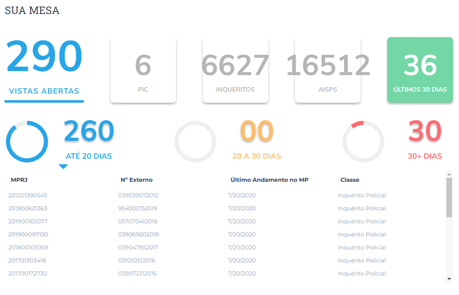
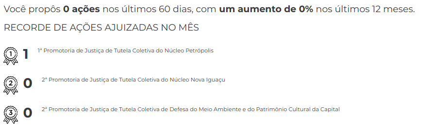
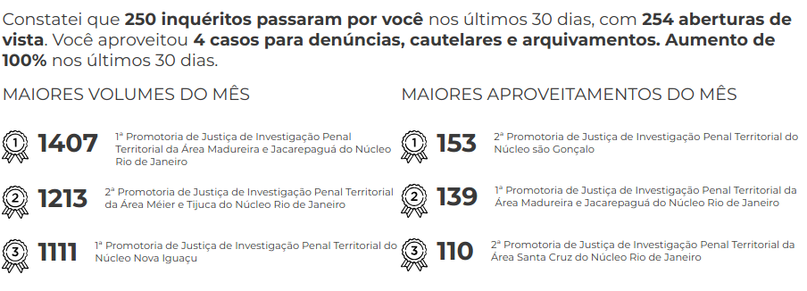
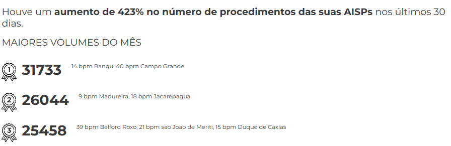

Sua Mesa
========

   SuaMesaFigura

O Sua Mesa é o segundo componente do Promotron. Nele podemos ver o
número de vistas abertas, procedimentos ativos, e procedimentos
finalizados nos últimos 30 dias.

Ele está separado em duas partes:

-  Sua Mesa Caixinhas: Correspondem aos quadrados na parte superior.
-  Sua Mesa Detalhes: Correspondem aos detalhes que aparecem na parte
   inferior ao clicar em determinadas Caixinhas.

Sua Mesa Caixinhas
------------------

   SuaMesaCaixinhasFigura

User Manual
~~~~~~~~~~~

As Caixinhas correspondem sempre a um número calculado de acordo com
determinada regra de negócio. O cálculo é feito diretamente no Oracle,
de forma que os dados utilizados são os disponíveis em tempo real
(embora possa haver cacheamento). Há, no momento, 8 tipos de regras
definidas (formando, assim 8 tipos de Caixinhas diferentes). São estas:

-  Vistas Abertas (Tutela e PIP): Vistas abertas para um determinado
   órgão e CPF.
-  Investigações (Tutela): Número de investigações em curso de uma
   Tutela Coletiva.
-  Processos (Tutela): Número de processos em juízo de uma Tutela
   Coletiva.
-  Finalizados (Tutela): Número de documentos finalizados nos últimos 30
   dias em uma tutela.
-  Inquéritos (PIP): Número de inquéritos ativos em uma PIP.
-  PICs (PIP): Número de PICs ativas em uma PIP.
-  AISP (PIP): Número de inquéritos + PICs ativos na AISP de uma PIP.
-  Finalizados (PIP): Número de documentos finalizados nos últimos 30
   dias para PIPs.

As regras para cada uma destas caixinhas são as seguintes:

Vistas Abertas
^^^^^^^^^^^^^^

Correspondem às vistas abertas para o órgão e CPF selecionados, e onde a
data de fechamento seja maior do que a data atual ou nula.

A query correspondente no BDA seria a seguinte:

::

   SELECT COUNT(*)
   FROM {schema_exadata}.MCPR_VISTA
   JOIN {schema_exadata}.MCPR_PESSOA_FISICA
     ON vist_pesf_pess_dk_resp_andam = pesf_pess_dk
   WHERE vist_orgi_orga_dk = {ORGAO_DADO}
   AND pesf_cpf = {CPF_DADO}
   AND (vist_dt_fechamento_vista IS NULL 
     OR vist_dt_fechamento_vista > current_timestamp())

Essa Caixinha serve para qualquer tipo de órgão, sendo usada tanto para
Tutelas quanto PIPs.

Investigações (Tutela)
^^^^^^^^^^^^^^^^^^^^^^

Esta Caixinha é para uso apenas de Tutela Coletiva. Ela busca os
documentos em andamento, e que não foram cancelados, das seguintes
classes:

+-----------------------------------+-----------------------------------+
| cldc_dk                           | hierarquia                        |
+===================================+===================================+
| 395                               | EXTRAJUDICIAIS > PROCEDIMENTOS DO |
|                                   | MP > Procedimento Preparatório    |
+-----------------------------------+-----------------------------------+
| 392                               | EXTRAJUDICIAIS > PROCEDIMENTOS DO |
|                                   | MP > Inquérito Civil              |
+-----------------------------------+-----------------------------------+
| 51223                             | EXTRAJUDICIAIS > PROCEDIMENTOS DO |
|                                   | MP > Procedimento Administrativo  |
|                                   | > Procedimento Administrativo de  |
|                                   | tutela de interesses individuais  |
|                                   | indisponíveis                     |
+-----------------------------------+-----------------------------------+
| 51222                             | EXTRAJUDICIAIS > PROCEDIMENTOS DO |
|                                   | MP > Procedimento Administrativo  |
|                                   | > Procedimento Administrativo de  |
|                                   | outras atividades não sujeitas a  |
|                                   | inquérito civil                   |
+-----------------------------------+-----------------------------------+
| 51220                             | EXTRAJUDICIAIS > PROCEDIMENTOS DO |
|                                   | MP > Procedimento Administrativo  |
|                                   | > Procedimento Administrativo de  |
|                                   | acompanhamento de Políticas       |
|                                   | Públicas                          |
+-----------------------------------+-----------------------------------+
| 51221                             | EXTRAJUDICIAIS > PROCEDIMENTOS DO |
|                                   | MP > Procedimento Administrativo  |
|                                   | > Procedimento Administrativo de  |
|                                   | acompanhamento de TAC             |
+-----------------------------------+-----------------------------------+
| 51219                             | EXTRAJUDICIAIS > PROCEDIMENTOS DO |
|                                   | MP > Procedimento Administrativo  |
|                                   | > Procedimento Administrativo de  |
|                                   | acompanhamento de Instituições    |
+-----------------------------------+-----------------------------------+

Processos (Tutela)
^^^^^^^^^^^^^^^^^^

Esta Caixinha é para uso apenas de Tutela Coletiva. Ela busca os
documentos em andamento, e que não foram cancelados, das seguintes
classes:

+-----------------------------------+-----------------------------------+
| cldc_dk                           | hierarquia                        |
+===================================+===================================+
| 323                               | PROCESSO CÍVEL E DO TRABALHO >    |
|                                   | Processo de Execução > Processo   |
|                                   | de Execução Trabalhista >         |
|                                   | Execução Provisória em Autos      |
|                                   | Suplementares                     |
+-----------------------------------+-----------------------------------+
| 319                               | PROCESSO CÍVEL E DO TRABALHO >    |
|                                   | Processo de Execução > Processo   |
|                                   | de Execução Trabalhista >         |
|                                   | Execução de Título Extrajudicial  |
+-----------------------------------+-----------------------------------+
| 320                               | PROCESSO CÍVEL E DO TRABALHO >    |
|                                   | Processo de Execução > Processo   |
|                                   | de Execução Trabalhista >         |
|                                   | Execução de Termo de Ajuste de    |
|                                   | Conduta                           |
+-----------------------------------+-----------------------------------+
| 18                                | SUPREMO TRIBUNAL FEDERAL > Ação   |
|                                   | Rescisória                        |
+-----------------------------------+-----------------------------------+
| 126                               | SUPERIOR TRIBUNAL DE JUSTIÇA >    |
|                                   | Ação Rescisória                   |
+-----------------------------------+-----------------------------------+
| 127                               | SUPERIOR TRIBUNAL DE JUSTIÇA >    |
|                                   | Ação de Improbidade               |
|                                   | Administrativa                    |
+-----------------------------------+-----------------------------------+
| 159                               | PROCESSO CÍVEL E DO TRABALHO >    |
|                                   | Processo de Conhecimento >        |
|                                   | Procedimento de Conhecimento >    |
|                                   | Procedimentos Especiais >         |
|                                   | Procedimentos Especiais de        |
|                                   | Jurisdição Contenciosa > Ação     |
|                                   | Rescisória                        |
+-----------------------------------+-----------------------------------+
| 175                               | PROCESSO CÍVEL E DO TRABALHO >    |
|                                   | Processo de Conhecimento >        |
|                                   | Procedimento de Conhecimento >    |
|                                   | Procedimentos Especiais >         |
|                                   | Procedimentos Regidos por Outros  |
|                                   | Códigos, Leis Esparsas e          |
|                                   | Regimentos > Ação Civil Coletiva  |
+-----------------------------------+-----------------------------------+
| 176                               | PROCESSO CÍVEL E DO TRABALHO >    |
|                                   | Processo de Conhecimento >        |
|                                   | Procedimento de Conhecimento >    |
|                                   | Procedimentos Especiais >         |
|                                   | Procedimentos Regidos por Outros  |
|                                   | Códigos, Leis Esparsas e          |
|                                   | Regimentos > Ação Civil de        |
|                                   | Improbidade Administrativa        |
+-----------------------------------+-----------------------------------+
| 177                               | PROCESSO CÍVEL E DO TRABALHO >    |
|                                   | Processo de Conhecimento >        |
|                                   | Procedimento de Conhecimento >    |
|                                   | Procedimentos Especiais >         |
|                                   | Procedimentos Regidos por Outros  |
|                                   | Códigos, Leis Esparsas e          |
|                                   | Regimentos > Ação Civil Pública   |
+-----------------------------------+-----------------------------------+
| 582                               | PROCESSO CRIMINAL > Execução      |
|                                   | Criminal > Execução Provisória    |
+-----------------------------------+-----------------------------------+
| 441                               | JUIZADOS DA INFÂNCIA E DA         |
|                                   | JUVENTUDE > Seção Cível >         |
|                                   | Processo de Conhecimento > Ação   |
|                                   | Civil Pública                     |
+-----------------------------------+-----------------------------------+
| 51205                             | PROCESSO CÍVEL E DO TRABALHO >    |
|                                   | Processo de Execução > Execução   |
|                                   | de Título Extrajudicial >         |
|                                   | Execução de Título Extrajudicial  |
|                                   | contra a Fazenda Pública          |
+-----------------------------------+-----------------------------------+
| 51217                             | PROCESSO CÍVEL E DO TRABALHO >    |
|                                   | Processo de Execução > Execução   |
|                                   | de Título Extrajudicial >         |
|                                   | Execução de Título Extrajudicial  |
+-----------------------------------+-----------------------------------+
| 51218                             | PROCESSO CÍVEL E DO TRABALHO >    |
|                                   | Processo de Execução > Execução   |
|                                   | de Título Extrajudicial >         |
|                                   | Execução Extrajudicial de         |
|                                   | Alimentos                         |
+-----------------------------------+-----------------------------------+

Além disso, a regra desta caixinha inclui uma etapa adicional em que o
número externo do documento (``docu_nr_externo``) é utilizado para
extrair o ano do documento, e o código do TJ.

Caso o ano extraído do número externo bata com o ano do documento
registrado no banco, e o número externo do TJ seja encontrado na posição
correta, ele é contabilizado.

Finalizados (Tutela)
^^^^^^^^^^^^^^^^^^^^

Esta Caixinha é para uso apenas de Tutelas.

Ela busca os documentos que tiveram pelo menos um andamento finalizador,
dentro de regras de andamento definidas. Os andamentos (e o documento
correspondente) não podem ter sido cancelados.

Além disso, essa contagem é feita apenas para andamentos que ocorreram
nos últimos 30 dias.

Desarquivamentos *não* são levados em consideração no cálculo. Isso quer
dizer que, caso um documento seja arquivado e posteriormente
desarquivado neste período de 30 dias, ele contará como finalizado neste
componente.

As regras de negócio definidas para os Finalizados de Tutela são as
seguintes:

+-----------------------------------+-----------------------------------+
| tppr_dk                           | hierarquia                        |
+===================================+===================================+
| 6015                              | MEMBRO > Arquivamento > Com       |
|                                   | remessa ao Conselho Superior >    |
|                                   | Integral sem TAC (Tutela          |
|                                   | individual)                       |
+-----------------------------------+-----------------------------------+
| 6016                              | MEMBRO > Arquivamento > Com       |
|                                   | remessa ao Conselho Superior >    |
|                                   | Parcial (Tutela individual)       |
+-----------------------------------+-----------------------------------+
| 6017                              | MEMBRO > Arquivamento > Com       |
|                                   | remessa ao Poder Judiciário >     |
|                                   | Integral > Extinção da            |
|                                   | Punibilidade por Outros           |
|                                   | Fundamentos                       |
+-----------------------------------+-----------------------------------+
| 6018                              | MEMBRO > Arquivamento > Com       |
|                                   | remessa ao Poder Judiciário >     |
|                                   | Integral > Ausência/Insuficiência |
|                                   | de Provas (Falta de Suporte       |
|                                   | Fático Probatório)                |
+-----------------------------------+-----------------------------------+
| 6019                              | MEMBRO > Arquivamento > Com       |
|                                   | remessa ao Poder Judiciário >     |
|                                   | Integral > Em razão de o          |
|                                   | adolescente ter alcançado a       |
|                                   | maioridade penal                  |
+-----------------------------------+-----------------------------------+
| 6020                              | MEMBRO > Arquivamento > Com       |
|                                   | remessa ao Poder Judiciário >     |
|                                   | Parcial > Extinção da             |
|                                   | Punibilidade por Outros           |
|                                   | Fundamentos                       |
+-----------------------------------+-----------------------------------+
| 6021                              | MEMBRO > Arquivamento > Com       |
|                                   | remessa ao Poder Judiciário >     |
|                                   | Parcial > Ausência/Insuficiência  |
|                                   | de Provas (Falta de Suporte       |
|                                   | Fático Probatório)                |
+-----------------------------------+-----------------------------------+
| 6022                              | MEMBRO > Arquivamento > Com       |
|                                   | remessa ao Poder Judiciário >     |
|                                   | Parcial > Em razão de o           |
|                                   | adolescente ter alcançado a       |
|                                   | maioridade penal                  |
+-----------------------------------+-----------------------------------+
| 6251                              | MEMBRO > Ajuizamento de Ação >    |
|                                   | Petição Inicial                   |
+-----------------------------------+-----------------------------------+
| 6324                              | MEMBRO > Arquivamento             |
+-----------------------------------+-----------------------------------+
| 6325                              | MEMBRO > Arquivamento > Com       |
|                                   | remessa ao Conselho Superior      |
+-----------------------------------+-----------------------------------+
| 6326                              | MEMBRO > Arquivamento > Com       |
|                                   | remessa ao Conselho Superior >    |
|                                   | Integral com TAC                  |
+-----------------------------------+-----------------------------------+
| 6327                              | MEMBRO > Arquivamento > Com       |
|                                   | remessa ao Conselho Superior >    |
|                                   | Integral sem TAC (Tutela          |
|                                   | coletiva)                         |
+-----------------------------------+-----------------------------------+
| 6328                              | MEMBRO > Arquivamento > Com       |
|                                   | remessa ao Conselho Superior >    |
|                                   | Parcial (Tutela coletiva)         |
+-----------------------------------+-----------------------------------+
| 6329                              | MEMBRO > Arquivamento > Com       |
|                                   | remessa ao Poder Judiciário       |
+-----------------------------------+-----------------------------------+
| 6330                              | MEMBRO > Arquivamento > Com       |
|                                   | remessa ao Poder Judiciário >     |
|                                   | Parcial                           |
+-----------------------------------+-----------------------------------+
| 6331                              | MEMBRO > Arquivamento > Com       |
|                                   | remessa ao Poder Judiciário >     |
|                                   | Parcial > Desconhecimento do      |
|                                   | Autor                             |
+-----------------------------------+-----------------------------------+
| 6332                              | MEMBRO > Arquivamento > Com       |
|                                   | remessa ao Poder Judiciário >     |
|                                   | Parcial > Inexistência de Crime   |
+-----------------------------------+-----------------------------------+
| 6333                              | MEMBRO > Arquivamento > Com       |
|                                   | remessa ao Poder Judiciário >     |
|                                   | Parcial > Prescrição              |
+-----------------------------------+-----------------------------------+
| 6334                              | MEMBRO > Arquivamento > Com       |
|                                   | remessa ao Poder Judiciário >     |
|                                   | Parcial > Decadência              |
+-----------------------------------+-----------------------------------+
| 6335                              | MEMBRO > Arquivamento > Com       |
|                                   | remessa ao Poder Judiciário >     |
|                                   | Parcial > Retratação Lei Maria da |
|                                   | Penha                             |
+-----------------------------------+-----------------------------------+
| 6336                              | MEMBRO > Arquivamento > Com       |
|                                   | remessa ao Poder Judiciário >     |
|                                   | Parcial > Pagamento de Débito     |
|                                   | Tributário                        |
+-----------------------------------+-----------------------------------+
| 6337                              | MEMBRO > Arquivamento > Com       |
|                                   | remessa ao Poder Judiciário >     |
|                                   | Integral                          |
+-----------------------------------+-----------------------------------+
| 6338                              | MEMBRO > Arquivamento > Com       |
|                                   | remessa ao Poder Judiciário >     |
|                                   | Integral > Desconhecimento do     |
|                                   | Autor                             |
+-----------------------------------+-----------------------------------+
| 6339                              | MEMBRO > Arquivamento > Com       |
|                                   | remessa ao Poder Judiciário >     |
|                                   | Integral > Inexistência de Crime  |
+-----------------------------------+-----------------------------------+
| 6340                              | MEMBRO > Arquivamento > Com       |
|                                   | remessa ao Poder Judiciário >     |
|                                   | Integral > Prescrição             |
+-----------------------------------+-----------------------------------+
| 6341                              | MEMBRO > Arquivamento > Com       |
|                                   | remessa ao Poder Judiciário >     |
|                                   | Integral > Decadência             |
+-----------------------------------+-----------------------------------+
| 6342                              | MEMBRO > Arquivamento > Com       |
|                                   | remessa ao Poder Judiciário >     |
|                                   | Integral > Retratação Lei Maria   |
|                                   | da Penha                          |
+-----------------------------------+-----------------------------------+
| 6343                              | MEMBRO > Arquivamento > Com       |
|                                   | remessa ao Poder Judiciário >     |
|                                   | Integral > Pagamento de Débito    |
|                                   | Tributário                        |
+-----------------------------------+-----------------------------------+
| 6344                              | MEMBRO > Arquivamento > Sem       |
|                                   | remessa ao Conselho               |
|                                   | Superior/Câmara                   |
+-----------------------------------+-----------------------------------+
| 6345                              | MEMBRO > Arquivamento > Sem       |
|                                   | remessa ao Conselho               |
|                                   | Superior/Câmara > Parcial         |
+-----------------------------------+-----------------------------------+
| 6346                              | MEMBRO > Arquivamento > Sem       |
|                                   | remessa ao Conselho               |
|                                   | Superior/Câmara > Integral        |
+-----------------------------------+-----------------------------------+
| 6350                              | MEMBRO > Homologação de           |
|                                   | Arquivamento                      |
+-----------------------------------+-----------------------------------+
| 6548                              | MEMBRO > Termo de reconhecimento  |
|                                   | de paternidade                    |
+-----------------------------------+-----------------------------------+
| 6553                              | MEMBRO > Arquivamento > Com       |
|                                   | remessa ao Poder Judiciário >     |
|                                   | Integral > Insuficiência de       |
|                                   | Provas                            |
+-----------------------------------+-----------------------------------+
| 6591                              | MEMBRO > Arquivamento > Com       |
|                                   | remessa ao Poder Judiciário >     |
|                                   | Integral > Falta de condições     |
|                                   | para o regular exercício do       |
|                                   | direito de ação                   |
+-----------------------------------+-----------------------------------+
| 6593                              | MEMBRO > Arquivamento > Com       |
|                                   | remessa ao Poder Judiciário >     |
|                                   | Parcial > Falta de condições para |
|                                   | o exercício do direito de ação    |
+-----------------------------------+-----------------------------------+
| 6644                              | MEMBRO > Arquivamento > Com       |
|                                   | remessa ao Conselho Superior >    |
|                                   | Integral sem TAC (Tutela          |
|                                   | coletiva) > Resolução da questão  |
+-----------------------------------+-----------------------------------+
| 6645                              | MEMBRO > Arquivamento > Com       |
|                                   | remessa ao Conselho Superior >    |
|                                   | Integral sem TAC (Tutela          |
|                                   | coletiva) > Por Outros Motivos >  |
|                                   | Não configuração de ilícito       |
+-----------------------------------+-----------------------------------+
| 6655                              | MEMBRO > Arquivamento > Com       |
|                                   | remessa ao Conselho Superior >    |
|                                   | Parcial (Tutela coletiva) > Com   |
|                                   | TAC                               |
+-----------------------------------+-----------------------------------+
| 6656                              | MEMBRO > Arquivamento > Com       |
|                                   | remessa ao Conselho Superior >    |
|                                   | Parcial (Tutela coletiva) > Sem   |
|                                   | TAC                               |
+-----------------------------------+-----------------------------------+
| 6657                              | MEMBRO > Arquivamento > Com       |
|                                   | remessa ao Conselho Superior >    |
|                                   | Parcial (Tutela coletiva) > Sem   |
|                                   | TAC > Resolução da questão        |
+-----------------------------------+-----------------------------------+
| 6658                              | MEMBRO > Arquivamento > Com       |
|                                   | remessa ao Conselho Superior >    |
|                                   | Parcial (Tutela coletiva) > Sem   |
|                                   | TAC > Por Outros Motivos > Não    |
|                                   | configuração de ilícito           |
+-----------------------------------+-----------------------------------+
| 6659                              | MEMBRO > Arquivamento > Com       |
|                                   | remessa ao Conselho Superior >    |
|                                   | Parcial (Tutela coletiva) > Sem   |
|                                   | TAC > Por Outros Motivos >        |
|                                   | Inveracidade do fato              |
+-----------------------------------+-----------------------------------+
| 6660                              | MEMBRO > Arquivamento > Com       |
|                                   | remessa ao Conselho Superior >    |
|                                   | Parcial (Tutela coletiva) > Sem   |
|                                   | TAC > Por Outros Motivos >        |
|                                   | Prescrição                        |
+-----------------------------------+-----------------------------------+
| 6661                              | MEMBRO > Arquivamento > Com       |
|                                   | remessa ao Conselho Superior >    |
|                                   | Parcial (Tutela coletiva) > Sem   |
|                                   | TAC > Por Outros Motivos > Perda  |
|                                   | do objeto sem resolução da        |
|                                   | questão                           |
+-----------------------------------+-----------------------------------+
| 6662                              | MEMBRO > Arquivamento > Com       |
|                                   | remessa ao Conselho Superior >    |
|                                   | Parcial (Tutela coletiva) > Sem   |
|                                   | TAC > Por Outros Motivos > Falta  |
|                                   | de uma das condições da ação      |
+-----------------------------------+-----------------------------------+
| 6663                              | MEMBRO > Arquivamento > Com       |
|                                   | remessa ao Conselho Superior >    |
|                                   | Parcial (Tutela coletiva) > Sem   |
|                                   | TAC > Por Outros Motivos > Outros |
+-----------------------------------+-----------------------------------+
| 6664                              | MEMBRO > Arquivamento > Com       |
|                                   | remessa ao Conselho Superior >    |
|                                   | Integral sem TAC (Tutela          |
|                                   | individual) > Resolução da        |
|                                   | questão                           |
+-----------------------------------+-----------------------------------+
| 6665                              | MEMBRO > Arquivamento > Com       |
|                                   | remessa ao Conselho Superior >    |
|                                   | Integral sem TAC (Tutela          |
|                                   | individual) > Não configuração de |
|                                   | ilícito                           |
+-----------------------------------+-----------------------------------+
| 6666                              | MEMBRO > Arquivamento > Com       |
|                                   | remessa ao Conselho Superior >    |
|                                   | Integral sem TAC (Tutela          |
|                                   | individual) > Inveracidade do     |
|                                   | fato                              |
+-----------------------------------+-----------------------------------+
| 6667                              | MEMBRO > Arquivamento > Com       |
|                                   | remessa ao Conselho Superior >    |
|                                   | Integral sem TAC (Tutela          |
|                                   | individual) > Perda do objeto sem |
|                                   | resolução da questão              |
+-----------------------------------+-----------------------------------+
| 6668                              | MEMBRO > Arquivamento > Com       |
|                                   | remessa ao Conselho Superior >    |
|                                   | Integral sem TAC (Tutela          |
|                                   | individual) > Falta de uma das    |
|                                   | condições da ação                 |
+-----------------------------------+-----------------------------------+
| 6669                              | MEMBRO > Arquivamento > Com       |
|                                   | remessa ao Conselho Superior >    |
|                                   | Integral sem TAC (Tutela          |
|                                   | individual) > Outros              |
+-----------------------------------+-----------------------------------+
| 6670                              | MEMBRO > Arquivamento > Com       |
|                                   | remessa ao Conselho Superior >    |
|                                   | Parcial (Tutela individual) > Com |
|                                   | TAC                               |
+-----------------------------------+-----------------------------------+
| 6671                              | MEMBRO > Arquivamento > Com       |
|                                   | remessa ao Conselho Superior >    |
|                                   | Parcial (Tutela individual) > Sem |
|                                   | TAC                               |
+-----------------------------------+-----------------------------------+
| 6672                              | MEMBRO > Arquivamento > Com       |
|                                   | remessa ao Conselho Superior >    |
|                                   | Parcial (Tutela individual) > Sem |
|                                   | TAC > Resolução da questão        |
+-----------------------------------+-----------------------------------+
| 6673                              | MEMBRO > Arquivamento > Com       |
|                                   | remessa ao Conselho Superior >    |
|                                   | Parcial (Tutela individual) > Sem |
|                                   | TAC > Não configuração de ilícito |
+-----------------------------------+-----------------------------------+
| 6674                              | MEMBRO > Arquivamento > Com       |
|                                   | remessa ao Conselho Superior >    |
|                                   | Parcial (Tutela individual) > Sem |
|                                   | TAC > Inveracidade do fato        |
+-----------------------------------+-----------------------------------+
| 6675                              | MEMBRO > Arquivamento > Com       |
|                                   | remessa ao Conselho Superior >    |
|                                   | Parcial (Tutela individual) > Sem |
|                                   | TAC > Perda do objeto sem         |
|                                   | resolução da questão              |
+-----------------------------------+-----------------------------------+
| 6676                              | MEMBRO > Arquivamento > Com       |
|                                   | remessa ao Conselho Superior >    |
|                                   | Parcial (Tutela individual) > Sem |
|                                   | TAC > Falta de uma das condições  |
|                                   | da ação                           |
+-----------------------------------+-----------------------------------+
| 6677                              | MEMBRO > Arquivamento > Com       |
|                                   | remessa ao Conselho Superior >    |
|                                   | Parcial (Tutela individual) > Sem |
|                                   | TAC > Outros                      |
+-----------------------------------+-----------------------------------+
| 6678                              | MEMBRO > Arquivamento > Com       |
|                                   | remessa ao Conselho Superior >    |
|                                   | Integral sem TAC (Tutela          |
|                                   | coletiva) > Por Outros Motivos >  |
|                                   | Inveracidade do fato              |
+-----------------------------------+-----------------------------------+
| 6679                              | MEMBRO > Arquivamento > Com       |
|                                   | remessa ao Conselho Superior >    |
|                                   | Integral sem TAC (Tutela          |
|                                   | coletiva) > Por Outros Motivos >  |
|                                   | Prescrição                        |
+-----------------------------------+-----------------------------------+
| 6680                              | MEMBRO > Arquivamento > Com       |
|                                   | remessa ao Conselho Superior >    |
|                                   | Integral sem TAC (Tutela          |
|                                   | coletiva) > Por Outros Motivos >  |
|                                   | Perda do objeto sem resolução da  |
|                                   | questão                           |
+-----------------------------------+-----------------------------------+
| 6681                              | MEMBRO > Arquivamento > Com       |
|                                   | remessa ao Conselho Superior >    |
|                                   | Integral sem TAC (Tutela          |
|                                   | coletiva) > Por Outros Motivos >  |
|                                   | Falta de uma das condições da     |
|                                   | ação                              |
+-----------------------------------+-----------------------------------+
| 6682                              | MEMBRO > Arquivamento > Com       |
|                                   | remessa ao Conselho Superior >    |
|                                   | Integral sem TAC (Tutela          |
|                                   | coletiva) > Por Outros Motivos >  |
|                                   | Outros                            |
+-----------------------------------+-----------------------------------+
| 7737                              | SERVIDOR > Atualização da fase    |
|                                   | para “Finalizado” em decorrência  |
|                                   | da vinculação como juntada        |
+-----------------------------------+-----------------------------------+
| 7745                              | MEMBRO > Arquivamento > De        |
|                                   | notícia de fato ou procedimento   |
|                                   | de atribuição originária do PGJ   |
+-----------------------------------+-----------------------------------+
| 7834                              | MEMBRO > Indeferimento de pedido  |
|                                   | de desarquivamento                |
+-----------------------------------+-----------------------------------+
| 7869                              | MEMBRO > Arquivamento > Com       |
|                                   | remessa ao Conselho Superior >    |
|                                   | Integral sem TAC (Tutela          |
|                                   | coletiva) > Por Outros Motivos    |
+-----------------------------------+-----------------------------------+
| 7870                              | MEMBRO > Arquivamento > Com       |
|                                   | remessa ao Conselho Superior >    |
|                                   | Parcial (Tutela coletiva) > Sem   |
|                                   | TAC > Por Outros Motivos          |
+-----------------------------------+-----------------------------------+
| 7871                              | MEMBRO > Arquivamento > Com       |
|                                   | remessa ao Poder Judiciário >     |
|                                   | Integral > Morte do Agente        |
+-----------------------------------+-----------------------------------+
| 7872                              | MEMBRO > Arquivamento > Com       |
|                                   | remessa ao Poder Judiciário >     |
|                                   | Parcial > Morte de Agente         |
+-----------------------------------+-----------------------------------+
| 7912                              | MEMBRO > Arquivamento > Com       |
|                                   | Remessa ao PRE/PGE                |
+-----------------------------------+-----------------------------------+

Inquéritos (PIP)
^^^^^^^^^^^^^^^^

Esta Caixinha é para uso apenas de PIPs. Ela busca os documentos em
andamento, e que não foram cancelados, das seguintes classes:

+-----------------------------------+-----------------------------------+
| cldc_dk                           | hierarquia                        |
+===================================+===================================+
| 3                                 | PROCESSO MILITAR > PROCESSO       |
|                                   | CRIMINAL > Procedimentos          |
|                                   | Investigatórios > Inquérito       |
|                                   | Policial Militar                  |
+-----------------------------------+-----------------------------------+
| 494                               | PROCESSO CRIMINAL > Procedimentos |
|                                   | Investigatórios > Inquérito       |
|                                   | Policial                          |
+-----------------------------------+-----------------------------------+

PICs (PIP)
^^^^^^^^^^

Esta Caixinha é para uso apenas de PIPs. Ela busca os documentos em
andamento, e que não foram cancelados, das seguintes classes:

+-----------------------------------+-----------------------------------+
| cldc_dk                           | hierarquia                        |
+===================================+===================================+
| 590                               | PROCESSO CRIMINAL > Procedimentos |
|                                   | Investigatórios > Procedimento    |
|                                   | Investigatório Criminal (PIC-MP)  |
+-----------------------------------+-----------------------------------+

AISPs (PIP)
^^^^^^^^^^^

Esta Caixinha é para uso apenas de PIPs. Ela busca os documentos em
andamento, e que não foram cancelados, para todas as promotorias
pertencentes à AISP da promotoria sendo analisada, das seguintes
classes:

+-----------------------------------+-----------------------------------+
| cldc_dk                           | hierarquia                        |
+===================================+===================================+
| 3                                 | PROCESSO MILITAR > PROCESSO       |
|                                   | CRIMINAL > Procedimentos          |
|                                   | Investigatórios > Inquérito       |
|                                   | Policial Militar                  |
+-----------------------------------+-----------------------------------+
| 494                               | PROCESSO CRIMINAL > Procedimentos |
|                                   | Investigatórios > Inquérito       |
|                                   | Policial                          |
+-----------------------------------+-----------------------------------+
| 590                               | PROCESSO CRIMINAL > Procedimentos |
|                                   | Investigatórios > Procedimento    |
|                                   | Investigatório Criminal (PIC-MP)  |
+-----------------------------------+-----------------------------------+

Finalizados (PIP)
^^^^^^^^^^^^^^^^^

Esta Caixinha é para uso apenas de PIPs.

Da mesma forma que a da Tutela, ela busca os documentos que tiveram pelo
menos um andamento finalizador, dentro de regras de andamento definidas.
Os andamentos (e o documento correspondente) não podem ter sido
cancelados.

Além disso, a contagem é feita apenas para andamentos que ocorreram nos
últimos 30 dias.

Desarquivamentos *não* são levados em consideração no cálculo. Isso quer
dizer que, caso um documento seja arquivado e posteriormente
desarquivado neste período de 30 dias, ele contará como finalizado neste
componente.

As regras de negócio definidas para os Finalizados de PIP são as
seguintes:

+-----------------------------------+-----------------------------------+
| tppr_dk                           | hierarquia                        |
+===================================+===================================+
| 6017                              | MEMBRO > Arquivamento > Com       |
|                                   | remessa ao Poder Judiciário >     |
|                                   | Integral > Extinção da            |
|                                   | Punibilidade por Outros           |
|                                   | Fundamentos                       |
+-----------------------------------+-----------------------------------+
| 6018                              | MEMBRO > Arquivamento > Com       |
|                                   | remessa ao Poder Judiciário >     |
|                                   | Integral > Ausência/Insuficiência |
|                                   | de Provas (Falta de Suporte       |
|                                   | Fático Probatório)                |
+-----------------------------------+-----------------------------------+
| 6019                              | MEMBRO > Arquivamento > Com       |
|                                   | remessa ao Poder Judiciário >     |
|                                   | Integral > Em razão de o          |
|                                   | adolescente ter alcançado a       |
|                                   | maioridade penal                  |
+-----------------------------------+-----------------------------------+
| 6253                              | MEMBRO > Ajuizamento de Ação >    |
|                                   | Denúncia > Escrita                |
+-----------------------------------+-----------------------------------+
| 6272                              | MEMBRO > Aditamento > Denúncia    |
+-----------------------------------+-----------------------------------+
| 6338                              | MEMBRO > Arquivamento > Com       |
|                                   | remessa ao Poder Judiciário >     |
|                                   | Integral > Desconhecimento do     |
|                                   | Autor                             |
+-----------------------------------+-----------------------------------+
| 6339                              | MEMBRO > Arquivamento > Com       |
|                                   | remessa ao Poder Judiciário >     |
|                                   | Integral > Inexistência de Crime  |
+-----------------------------------+-----------------------------------+
| 6340                              | MEMBRO > Arquivamento > Com       |
|                                   | remessa ao Poder Judiciário >     |
|                                   | Integral > Prescrição             |
+-----------------------------------+-----------------------------------+
| 6341                              | MEMBRO > Arquivamento > Com       |
|                                   | remessa ao Poder Judiciário >     |
|                                   | Integral > Decadência             |
+-----------------------------------+-----------------------------------+
| 6342                              | MEMBRO > Arquivamento > Com       |
|                                   | remessa ao Poder Judiciário >     |
|                                   | Integral > Retratação Lei Maria   |
|                                   | da Penha                          |
+-----------------------------------+-----------------------------------+
| 6343                              | MEMBRO > Arquivamento > Com       |
|                                   | remessa ao Poder Judiciário >     |
|                                   | Integral > Pagamento de Débito    |
|                                   | Tributário                        |
+-----------------------------------+-----------------------------------+
| 6346                              | MEMBRO > Arquivamento > Sem       |
|                                   | remessa ao Conselho               |
|                                   | Superior/Câmara > Integral        |
+-----------------------------------+-----------------------------------+
| 6350                              | MEMBRO > Homologação de           |
|                                   | Arquivamento                      |
+-----------------------------------+-----------------------------------+
| 6359                              | MEMBRO > Decisão Artigo 28 CPP /  |
|                                   | 397 CPPM > Confirmação Integral > |
|                                   | Arquivamento                      |
+-----------------------------------+-----------------------------------+
| 6361                              | MEMBRO > Proposta de transação    |
|                                   | penal                             |
+-----------------------------------+-----------------------------------+
| 6362                              | MEMBRO > Proposta de suspensão    |
|                                   | condicional do processo           |
+-----------------------------------+-----------------------------------+
| 6377                              | MEMBRO > Ciência > Sentença >     |
|                                   | Extintiva pela prescrição         |
+-----------------------------------+-----------------------------------+
| 6378                              | MEMBRO > Ciência > Sentença >     |
|                                   | Extintiva por outras causas       |
+-----------------------------------+-----------------------------------+
| 6392                              | MEMBRO > Ciência > Arquivamento   |
+-----------------------------------+-----------------------------------+
| 6436                              | MEMBRO > Ratificação de Denúncia  |
+-----------------------------------+-----------------------------------+
| 6524                              | SERVIDOR > Arquivamento           |
+-----------------------------------+-----------------------------------+
| 6591                              | MEMBRO > Arquivamento > Com       |
|                                   | remessa ao Poder Judiciário >     |
|                                   | Integral > Falta de condições     |
|                                   | para o regular exercício do       |
|                                   | direito de ação                   |
+-----------------------------------+-----------------------------------+
| 6625                              | SERVIDOR > Informação sobre       |
|                                   | ajuizamento do documento no Poder |
|                                   | Judiciário                        |
+-----------------------------------+-----------------------------------+
| 6669                              | MEMBRO > Arquivamento > Com       |
|                                   | remessa ao Conselho Superior >    |
|                                   | Integral sem TAC (Tutela          |
|                                   | individual) > Outros              |
+-----------------------------------+-----------------------------------+
| 6682                              | MEMBRO > Arquivamento > Com       |
|                                   | remessa ao Conselho Superior >    |
|                                   | Integral sem TAC (Tutela          |
|                                   | coletiva) > Por Outros Motivos >  |
|                                   | Outros                            |
+-----------------------------------+-----------------------------------+
| 6718                              | SERVIDOR > Informação sobre o     |
|                                   | encaminhamento a Juízo para       |
|                                   | juntada a processo judicial       |
+-----------------------------------+-----------------------------------+
| 7737                              | SERVIDOR > Atualização da fase    |
|                                   | para “Finalizado” em decorrência  |
|                                   | da vinculação como juntada        |
+-----------------------------------+-----------------------------------+
| 7745                              | MEMBRO > Arquivamento > De        |
|                                   | notícia de fato ou procedimento   |
|                                   | de atribuição originária do PGJ   |
+-----------------------------------+-----------------------------------+
| 7811                              | SERVIDOR > Finalização de         |
|                                   | processo judicial                 |
+-----------------------------------+-----------------------------------+
| 7834                              | MEMBRO > Indeferimento de pedido  |
|                                   | de desarquivamento                |
+-----------------------------------+-----------------------------------+
| 7871                              | MEMBRO > Arquivamento > Com       |
|                                   | remessa ao Poder Judiciário >     |
|                                   | Integral > Morte do Agente        |
+-----------------------------------+-----------------------------------+
| 7915                              | MEMBRO > Acordo de Não Persecução |
|                                   | Penal > Oferecimento de acordo    |
+-----------------------------------+-----------------------------------+

Estrutura do Código
~~~~~~~~~~~~~~~~~~~

Endpoint:

::

   GET /dominio/suamesa/documentos/<str:orgao_id>?tipo=tipo_de_dado&cpf=1234

   CPF é obrigatório apenas para alguns tipos de dado (ver lista abaixo).

   Tipos aceitos:
   - vistas: Vistas abertas para um órgão e CPF. (cpf obrigatório)
   - tutela_investigacoes: Número de investigações em curso de uma tutela.
   - tutela_processos: Número de processos em juízo de uma tutela.
   - tutela_finalizados: Número de documentos finalizados nos últimos 30 dias em uma tutela.
   - pip_inqueritos: Número de inquéritos ativos em uma PIP.
   - pip_pics: Número de PICs ativas em uma PIP.
   - pip_aisp: Número de inquéritos e PICs ativos na AISP de uma PIP.
   - pip_finalizados: Número de documentos finalizados nos últimos 30 dias para PIPs.

::

   HTTP 200 OK
   Allow: GET, HEAD, OPTIONS
   Content-Type: application/json
   Vary: Accept

   {
       "nr_documentos": 1
   }

Nome da View: `SuaMesaView`_. 

O Sua Mesa Caixinhas é organizado em uma estrutura de Factory, por meio
de um DAO (Data Access Object). Isso quer dizer que as requisições são
feitas para um único endpoint/View, que se encarregará de repassá-la
para um DAO que decidirá qual função chamar para obter o dado do tipo
enviado no request.

Este DAO também se encarrega de verificar que o request veio com o
parâmetro de tipo definido, e que existe uma função para buscar o tipo
requisitado.

As regras de negócio explicadas na seção User Manual estão contidas
dentro destas funções correspondentes a cada tipo de dado.

Estes dados são buscados diretamente no Oracle (por meio da ORM do
Django). Isso quer dizer que, além dos cálculos serem realizados em
tempo real, não há processos adicionais sendo realizados no BDA para
este componente (criação ou uso de tabelas, por exemplo).

As queries ao Oracle estão todas definidas nos `Managers`_, e se
encarregam apenas de receber os parâmetros necessários para um
determinado cálculo.

Isso é útil para evitar a repetição de certos processamentos.

Por exemplo, os tipos de dados de Investigações (Tutela), Inquéritos
(PIP) e PICs (PIP) são essencialmente os mesmos - buscar documentos
ativos de certas classes. Por isso, os 3 fazem uso da mesma query
definida nos `Managers`_ (InvestigacoesManager.em_curso).

.. _SuaMesaView: https://github.com/MinisterioPublicoRJ/apimpmapas/blob/develop/dominio/suamesa/views.py
.. _Managers: https://github.com/MinisterioPublicoRJ/apimpmapas/blob/develop/dominio/managers.py

Dependências
~~~~~~~~~~~~

Não há dependências de tabelas (a não ser as do Oracle).

Troubleshooting
~~~~~~~~~~~~~~~

Como este componente não possui nenhum processo relacionado ou acesso de
tabelas no BDA, quaisquer problemas que possam surgir estarão
obrigatoriamente no backend (ou nos dados vindos do Oracle).

-  O endpoint está retornando algum dado? Com os nomes de atributo
   corretos na resposta? Se o dado está sendo retornado corretamente, o
   problema pode estar no Front.
-  Caso o dado esteja vindo com um número diferente do que deveria:

   -  Se for vistas abertas, o CPF está correto? Se sim, é possível que
      aquele CPF não esteja com vistas abertas no banco. Rodar a query
      de vistas abertas dada mais acima no BDA (ou diretamente no
      Oracle) pode ajudar a descobrir o problema.
   -  Se o problema for em outro tipo de dado, é possível que os
      documentos estejam sendo registrados com outras classes (ou os
      andamentos, no caso de Finalizados). Neste caso, as seguintes
      queries podem ajudar:

Para verificar os tipos de andamentos que apareceram nos últimos 30 dias
para um dado órgão:

::

   SELECT stao_tppr_dk, hierarquia, COUNT(1)
   FROM exadata_dev.mcpr_vista
   JOIN exadata_dev.mcpr_andamento ON vist_dk = pcao_vist_dk
   JOIN exadata_dev.mcpr_sub_andamento ON stao_pcao_dk = pcao_dk
   JOIN exadata_aux_dev.mmps_tp_andamento ON id = stao_tppr_dk
   WHERE vist_orgi_orga_dk = 400551
   AND pcao_dt_andamento >= days_sub(current_timestamp(), 30)
   GROUP BY stao_tppr_dk, hierarquia
   ORDER BY stao_tppr_dk;

Para verificar as classes de documentos ativos atualmente em um dado
órgão:

::

   SELECT docu_cldc_dk, hierarquia, COUNT(1)
   FROM exadata_dev.mcpr_documento
   JOIN exadata_aux_dev.mmps_classe_docto ON id = docu_cldc_dk
   WHERE docu_orgi_orga_dk_responsavel = 400551
   AND docu_tpst_dk != 11
   AND docu_fsdc_dk = 1
   GROUP BY docu_cldc_dk, hierarquia
   ORDER BY docu_cldc_dk;

Sua Mesa Detalhe
----------------

.. _user-manual-1:

User Manual
~~~~~~~~~~~

O Sua Mesa Detalhe corresponde à parte inferior do Sua Mesa, que mostra
os detalhes relacionados a cada uma das Caixinhas.

Há, porém, algumas exceções importantes de esclarecer. Primeiramente, a
Caixinhas de Finalizados não possui detalhe. E segundo, o detalhe de
vistas abertas, por fugir do padrão dos outros tipos de detalhe, é
calculado em um endpoint separado (e por isso tem sua própria seção
separada, mais abaixo).

Dito isso, existem 5 tipos de detalhe definidos neste componente:

-  Detalhe Investigações (Tutela)
-  Detalhe Processos (Tutela)
-  Detalhe Inquéritos (PIP)
-  Detalhe PICs (PIP)
-  Detalhe AISPs (PIP)

Vamos falar sobre eles individualmente.

Detalhe Investigações (Tutela)
^^^^^^^^^^^^^^^^^^^^^^^^^^^^^^

   title

!! Tem um bug no ranking ao que parece, não está mostrando reduções, e sim aumentos!

Este detalhe mostra simplesmente a variação do acervo de investigações
de um Tutela Coletiva. A janela de comparação é o mês corrente x o mês
anterior até o mesmo dia do mês (ou mais próximo).

Também há um ranking das promotorias com maiores variações do acervo.

As regras de negócio utilizadas para definir acervo são as mesmas da
Caixinha de Investigações (Tutela). No entanto, elas são definidas
novamente no código deste componente, de forma que faz sentido
repeti-las aqui:

+-----------------------------------+-----------------------------------+
| cldc_dk                           | hierarquia                        |
+===================================+===================================+
| 395                               | EXTRAJUDICIAIS > PROCEDIMENTOS DO |
|                                   | MP > Procedimento Preparatório    |
+-----------------------------------+-----------------------------------+
| 392                               | EXTRAJUDICIAIS > PROCEDIMENTOS DO |
|                                   | MP > Inquérito Civil              |
+-----------------------------------+-----------------------------------+
| 51223                             | EXTRAJUDICIAIS > PROCEDIMENTOS DO |
|                                   | MP > Procedimento Administrativo  |
|                                   | > Procedimento Administrativo de  |
|                                   | tutela de interesses individuais  |
|                                   | indisponíveis                     |
+-----------------------------------+-----------------------------------+
| 51222                             | EXTRAJUDICIAIS > PROCEDIMENTOS DO |
|                                   | MP > Procedimento Administrativo  |
|                                   | > Procedimento Administrativo de  |
|                                   | outras atividades não sujeitas a  |
|                                   | inquérito civil                   |
+-----------------------------------+-----------------------------------+
| 51220                             | EXTRAJUDICIAIS > PROCEDIMENTOS DO |
|                                   | MP > Procedimento Administrativo  |
|                                   | > Procedimento Administrativo de  |
|                                   | acompanhamento de Políticas       |
|                                   | Públicas                          |
+-----------------------------------+-----------------------------------+
| 51221                             | EXTRAJUDICIAIS > PROCEDIMENTOS DO |
|                                   | MP > Procedimento Administrativo  |
|                                   | > Procedimento Administrativo de  |
|                                   | acompanhamento de TAC             |
+-----------------------------------+-----------------------------------+
| 51219                             | EXTRAJUDICIAIS > PROCEDIMENTOS DO |
|                                   | MP > Procedimento Administrativo  |
|                                   | > Procedimento Administrativo de  |
|                                   | acompanhamento de Instituições    |
+-----------------------------------+-----------------------------------+

Detalhe Processos (Tutela)
^^^^^^^^^^^^^^^^^^^^^^^^^^

   title

Número de ajuizamentos de ação que ocorreram nos períodos indicados (em
número de dias correntes), para documentos não-cancelados, cuja vista do
andamento tenha sido aberta para o órgão. Ajuizamento de ação é definido
pela seguinte regra de andamento:

+---------+------------------------------------------------+
| tppr_dk | hierarquia                                     |
+=========+================================================+
| 6251    | MEMBRO > Ajuizamento de Ação > Petição Inicial |
+---------+------------------------------------------------+

O aumento nos últimos 12 meses é calculado comparando o número de
ajuizamentos nos últimos 360 dias correntes x 360 dias anteriores.

Para que estes dados sejam calculados para o órgão, ele necessariamente
deve ter um pacote de atribuição definido na tabela
``ATUALIZACAO_PJ_PACOTE``.

Detalhe Inquéritos (PIP)
^^^^^^^^^^^^^^^^^^^^^^^^

   title

Este detalhe mostra diversas informações sobre os inquéritos que
passaram por uma PIP e CPF. São elas:

-  **Inquéritos que passaram pelo promotor** (ou seja, que tiveram vista
   aberta), no mês corrente. Aqui, um inquérito é contado apenas uma
   vez.
-  Número de **aberturas de vistas** total destes inquéritos. Aqui, se
   um inquérito tiver tido 2 vistas abertas, ele será contado 2 vezes.
-  Número de **aproveitamentos**, ou seja, número de inquéritos que
   tiveram denúncias, cautelares ou arquivamentos realizados. A contagem
   é por documento, não por andamento. De forma que se um inquérito
   tiver vários andamentos desses tipos, ele é contado apenas uma vez.
-  Porcentagem de aumento dos aproveitamentos, mês corrente x mês
   anterior até o mesmo dia.

Lembrando que estes dados são relativos ao **órgão e CPF**.

Também há dois rankings das promotorias:

-  Maiores volumes: É um ranking do número de inquéritos distintos que
   tiveram vistas abertas no órgão, no mês corrente.
-  Maiores aproveitamentos: É um ranking de número de inquéritos que
   tiveram aproveitamentos, no mês corrente.

Nos rankings, os dados são agregados por **órgão**.

As regras de negócio utilizadas para definir inquéritos são as mesmas da
Caixinha de Inquéritos (PIP). No entanto, elas são definidas novamente
no código deste componente, de forma que faz sentido repeti-las aqui:

+-----------------------------------+-----------------------------------+
| cldc_dk                           | hierarquia                        |
+===================================+===================================+
| 3                                 | PROCESSO MILITAR > PROCESSO       |
|                                   | CRIMINAL > Procedimentos          |
|                                   | Investigatórios > Inquérito       |
|                                   | Policial Militar                  |
+-----------------------------------+-----------------------------------+
| 494                               | PROCESSO CRIMINAL > Procedimentos |
|                                   | Investigatórios > Inquérito       |
|                                   | Policial                          |
+-----------------------------------+-----------------------------------+

Além disso, também há as regras usadas para definir aproveitamentos:

+-----------------------------------+-----------------------------------+
| tppr_dk                           | hierarquia                        |
+===================================+===================================+
| 1030                              | Propositura de medida cautelar    |
|                                   | autônoma                          |
+-----------------------------------+-----------------------------------+
| 1201                              | Oferecimento de denúncia          |
+-----------------------------------+-----------------------------------+
| 1202                              | Oferecimento de denúncia com      |
|                                   | pedido de prisão                  |
+-----------------------------------+-----------------------------------+
| 1208                              | Manifestação em medida cautelar   |
|                                   | requerida pela autoridade         |
|                                   | policial                          |
+-----------------------------------+-----------------------------------+
| 6017                              | MEMBRO > Arquivamento > Com       |
|                                   | remessa ao Poder Judiciário >     |
|                                   | Integral > Extinção da            |
|                                   | Punibilidade por Outros           |
|                                   | Fundamentos                       |
+-----------------------------------+-----------------------------------+
| 6018                              | MEMBRO > Arquivamento > Com       |
|                                   | remessa ao Poder Judiciário >     |
|                                   | Integral > Ausência/Insuficiência |
|                                   | de Provas (Falta de Suporte       |
|                                   | Fático Probatório)                |
+-----------------------------------+-----------------------------------+
| 6020                              | MEMBRO > Arquivamento > Com       |
|                                   | remessa ao Poder Judiciário >     |
|                                   | Parcial > Extinção da             |
|                                   | Punibilidade por Outros           |
|                                   | Fundamentos                       |
+-----------------------------------+-----------------------------------+
| 6038                              | MEMBRO > Medida Incidental        |
|                                   | (cautelar) > Requerimento de      |
|                                   | Medida Cautelar de Interceptação  |
|                                   | Telefônica                        |
+-----------------------------------+-----------------------------------+
| 6039                              | MEMBRO > Medida Incidental        |
|                                   | (cautelar) > Requerimento de      |
|                                   | Medida Cautelar de Interceptação  |
|                                   | de Dados Telemáticos              |
+-----------------------------------+-----------------------------------+
| 6040                              | MEMBRO > Medida Incidental        |
|                                   | (cautelar) > Requerimento de      |
|                                   | Medida Cautelar de Obtenção de    |
|                                   | Dados Cadastrais                  |
+-----------------------------------+-----------------------------------+
| 6041                              | MEMBRO > Medida Incidental        |
|                                   | (cautelar) > Requerimento de      |
|                                   | Medida Cautelar de Quebra de      |
|                                   | Sigilo Bancário                   |
+-----------------------------------+-----------------------------------+
| 6042                              | MEMBRO > Medida Incidental        |
|                                   | (cautelar) > Requerimento de      |
|                                   | Medida Cautelar de Quebra de      |
|                                   | Sigilo Fiscal                     |
+-----------------------------------+-----------------------------------+
| 6043                              | MEMBRO > Medida Incidental        |
|                                   | (cautelar) > Outros Requerimentos |
|                                   | de Natureza Cautelar              |
+-----------------------------------+-----------------------------------+
| 6252                              | MEMBRO > Ajuizamento de Ação >    |
|                                   | Denúncia                          |
+-----------------------------------+-----------------------------------+
| 6253                              | MEMBRO > Ajuizamento de Ação >    |
|                                   | Denúncia > Escrita                |
+-----------------------------------+-----------------------------------+
| 6254                              | MEMBRO > Ajuizamento de Ação >    |
|                                   | Denúncia > Oral                   |
+-----------------------------------+-----------------------------------+
| 6257                              | MEMBRO > Medida Incidental        |
|                                   | (cautelar)                        |
+-----------------------------------+-----------------------------------+
| 6258                              | MEMBRO > Medida Incidental        |
|                                   | (cautelar) > Requerimento de      |
|                                   | Medida Protetiva                  |
+-----------------------------------+-----------------------------------+
| 6338                              | MEMBRO > Arquivamento > Com       |
|                                   | remessa ao Poder Judiciário >     |
|                                   | Integral > Desconhecimento do     |
|                                   | Autor                             |
+-----------------------------------+-----------------------------------+
| 6339                              | MEMBRO > Arquivamento > Com       |
|                                   | remessa ao Poder Judiciário >     |
|                                   | Integral > Inexistência de Crime  |
+-----------------------------------+-----------------------------------+
| 6340                              | MEMBRO > Arquivamento > Com       |
|                                   | remessa ao Poder Judiciário >     |
|                                   | Integral > Prescrição             |
+-----------------------------------+-----------------------------------+
| 6341                              | MEMBRO > Arquivamento > Com       |
|                                   | remessa ao Poder Judiciário >     |
|                                   | Integral > Decadência             |
+-----------------------------------+-----------------------------------+
| 6342                              | MEMBRO > Arquivamento > Com       |
|                                   | remessa ao Poder Judiciário >     |
|                                   | Integral > Retratação Lei Maria   |
|                                   | da Penha                          |
+-----------------------------------+-----------------------------------+
| 6343                              | MEMBRO > Arquivamento > Com       |
|                                   | remessa ao Poder Judiciário >     |
|                                   | Integral > Pagamento de Débito    |
|                                   | Tributário                        |
+-----------------------------------+-----------------------------------+
| 6346                              | MEMBRO > Arquivamento > Sem       |
|                                   | remessa ao Conselho               |
|                                   | Superior/Câmara > Integral        |
+-----------------------------------+-----------------------------------+
| 6350                              | MEMBRO > Homologação de           |
|                                   | Arquivamento                      |
+-----------------------------------+-----------------------------------+
| 6359                              | MEMBRO > Decisão Artigo 28 CPP /  |
|                                   | 397 CPPM > Confirmação Integral > |
|                                   | Arquivamento                      |
+-----------------------------------+-----------------------------------+
| 6367                              | MEMBRO > Requerimento de Prisão > |
|                                   | Preventiva > Preventiva - Art.    |
|                                   | 312 CPP                           |
+-----------------------------------+-----------------------------------+
| 6368                              | MEMBRO > Requerimento de Prisão > |
|                                   | Preventiva > Preventiva - Art.    |
|                                   | 366 CPP                           |
+-----------------------------------+-----------------------------------+
| 6369                              | MEMBRO > Requerimento de Prisão > |
|                                   | Preventiva > Preventiva - Art.    |
|                                   | 255 CPPM                          |
+-----------------------------------+-----------------------------------+
| 6370                              | MEMBRO > Requerimento de Prisão > |
|                                   | Temporária                        |
+-----------------------------------+-----------------------------------+
| 6392                              | MEMBRO > Ciência > Arquivamento   |
+-----------------------------------+-----------------------------------+
| 6549                              | MEMBRO > Arquivamento > Com       |
|                                   | remessa ao Centro de Apoio        |
|                                   | Operacional das Promotorias       |
|                                   | Eleitorais – CAO Eleitoral (EN    |
|                                   | 30-CSMP)                          |
+-----------------------------------+-----------------------------------+
| 6591                              | MEMBRO > Arquivamento > Com       |
|                                   | remessa ao Poder Judiciário >     |
|                                   | Integral > Falta de condições     |
|                                   | para o regular exercício do       |
|                                   | direito de ação                   |
+-----------------------------------+-----------------------------------+
| 6593                              | MEMBRO > Arquivamento > Com       |
|                                   | remessa ao Poder Judiciário >     |
|                                   | Parcial > Falta de condições para |
|                                   | o exercício do direito de ação    |
+-----------------------------------+-----------------------------------+
| 6620                              | MEMBRO > Requerimento de Prisão > |
|                                   | Preventiva > Preventiva - Art.    |
|                                   | 310, II, CPP (conversão)          |
+-----------------------------------+-----------------------------------+
| 6648                              | MEMBRO > Ajuizamento de Ação >    |
|                                   | Requerimento de Outras Medidas    |
|                                   | Cautelares (Não Incidentais)      |
+-----------------------------------+-----------------------------------+
| 6649                              | MEMBRO > Ajuizamento de Ação >    |
|                                   | Requerimento de Outras Medidas    |
|                                   | Cautelares (Não Incidentais) >    |
|                                   | Requerimento de Medida Cautelar   |
|                                   | de Interceptação Telefônica       |
+-----------------------------------+-----------------------------------+
| 6650                              | MEMBRO > Ajuizamento de Ação >    |
|                                   | Requerimento de Outras Medidas    |
|                                   | Cautelares (Não Incidentais) >    |
|                                   | Requerimento de Medida Cautelar   |
|                                   | de Interceptação de Dados         |
|                                   | Telemáticos                       |
+-----------------------------------+-----------------------------------+
| 6651                              | MEMBRO > Ajuizamento de Ação >    |
|                                   | Requerimento de Outras Medidas    |
|                                   | Cautelares (Não Incidentais) >    |
|                                   | Requerimento de Medida Cautelar   |
|                                   | de Obtenção de Dados Cadastrais   |
+-----------------------------------+-----------------------------------+
| 6652                              | MEMBRO > Ajuizamento de Ação >    |
|                                   | Requerimento de Outras Medidas    |
|                                   | Cautelares (Não Incidentais) >    |
|                                   | Requerimento de Medida Cautelar   |
|                                   | de Quebra de Sigilo Bancário      |
+-----------------------------------+-----------------------------------+
| 6653                              | MEMBRO > Ajuizamento de Ação >    |
|                                   | Requerimento de Outras Medidas    |
|                                   | Cautelares (Não Incidentais) >    |
|                                   | Requerimento de Medida Cautelar   |
|                                   | de Quebra de Sigilo Fiscal        |
+-----------------------------------+-----------------------------------+
| 6654                              | MEMBRO > Ajuizamento de Ação >    |
|                                   | Requerimento de Outras Medidas    |
|                                   | Cautelares (Não Incidentais) >    |
|                                   | Outros Requerimentos de Natureza  |
|                                   | Cautelar (não incidentais)        |
+-----------------------------------+-----------------------------------+
| 7745                              | MEMBRO > Arquivamento > De        |
|                                   | notícia de fato ou procedimento   |
|                                   | de atribuição originária do PGJ   |
+-----------------------------------+-----------------------------------+
| 7815                              | MEMBRO > Medida Incidental        |
|                                   | (cautelar) > Requerimento de      |
|                                   | Medida Cautelar de Busca e        |
|                                   | Apreensão                         |
+-----------------------------------+-----------------------------------+
| 7816                              | MEMBRO > Ajuizamento de Ação >    |
|                                   | Requerimento de Outras Medidas    |
|                                   | Cautelares (Não Incidentais) >    |
|                                   | Requerimento de Medida Cautelar   |
|                                   | de Busca e Apreensão              |
+-----------------------------------+-----------------------------------+
| 7871                              | MEMBRO > Arquivamento > Com       |
|                                   | remessa ao Poder Judiciário >     |
|                                   | Integral > Morte do Agente        |
+-----------------------------------+-----------------------------------+
| 7877                              | MEMBRO > Medida Incidental        |
|                                   | (cautelar) > Requerimento de      |
|                                   | Medida Cautelar do Art. 319 CPP   |
+-----------------------------------+-----------------------------------+
| 7878                              | MEMBRO > Ajuizamento de Ação >    |
|                                   | Requerimento de Outras Medidas    |
|                                   | Cautelares (Não Incidentais) >    |
|                                   | Requerimento de Medida Cautelar   |
|                                   | do Art. 319 CPP                   |
+-----------------------------------+-----------------------------------+
| 7897                              | MEMBRO > Decisão Artigo 28 CPP /  |
|                                   | 397 CPPM > Confirmação Parcial >  |
|                                   | Arquivamento                      |
+-----------------------------------+-----------------------------------+
| 7912                              | MEMBRO > Arquivamento > Com       |
|                                   | Remessa ao PRE/PGE                |
+-----------------------------------+-----------------------------------+

Detalhe PICs (PIP)
^^^^^^^^^^^^^^^^^^

O detalhe das PICs é muito parecido com o detalhe dos inquéritos, com um
dado sobre número de instaurações a mais. Ou seja, ele possuirá os
seguintes dados:

-  **PICs que passaram pelo promotor** (ou seja, que tiveram vista
   aberta), no mês corrente. Aqui, um PIC é contado apenas uma vez.
-  Número de **instaurações** de PICs no mês corrente. Isso é calculado
   por meio da data de cadastro do documento na tabela. Ou seja, se um
   documento for cadastrado no sistema no mês corrente, ele contará como
   uma instauração.
-  Número de **aberturas de vistas** total destes PICs. Aqui, se um PIC
   tiver tido 2 vistas abertas, ele será contado 2 vezes.
-  Número de **aproveitamentos**, ou seja, número de PICs que tiveram
   denúncias, cautelares ou arquivamentos realizados. A contagem é por
   documento, não por andamento. De forma que se um inquérito tiver
   vários andamentos desses tipos, ele é contado apenas uma vez.
-  Porcentagem de aumento dos aproveitamentos, mês corrente x mês
   anterior até o mesmo dia.

A regra para definir PIC é a mesma da Caixinha de PICs:

+-----------------------------------+-----------------------------------+
| cldc_dk                           | hierarquia                        |
+===================================+===================================+
| 590                               | PROCESSO CRIMINAL > Procedimentos |
|                                   | Investigatórios > Procedimento    |
|                                   | Investigatório Criminal (PIC-MP)  |
+-----------------------------------+-----------------------------------+

Os andamentos definidos como aproveitamentos são os mesmos do Detalhe
Inquéritos acima.

Detalhe AISPs (PIP)
^^^^^^^^^^^^^^^^^^^

   title

O detalhe de AISPs mostra o aumento do número de procedimentos da AISP
do órgão em questão, no mês corrente x mês anterior até o mesmo dia.

Procedimentos são definidos juntando as regras de documentos usadas no
Detalhe Inquéritos e Detalhe PICs.

O ranking mostra, no mês corrente, as AISPs que possuem o maior número
de procedimentos.

.. _estrutura-do-código-1:

Estrutura do Código
~~~~~~~~~~~~~~~~~~~

Processo BDA
************

Há 3 tabelas ligadas a este componente no BDA, separadas em dois processos:

-  TB_DETALHE_PROCESSO
-  TB_DETALHE_DOCUMENTOS_ORGAO
-  TB_DETALHE_DOCUMENTOS_ORGAO_CPF

::

   Nome da Tabela: TB_DETALHE_PROCESSO
   Colunas: 
      orgao_id (int)
      nm_orgao (string)
      cod_pct (int)
      nr_acoes_12_meses_anterior (int)
      nr_acoes_12_meses_atual (int)
      nr_acoes_ultimos_60_dias (int)
      nr_acoes_ultimos_30_dias (int)
      variacao_12_meses (double)

Esta tabela é calculada levando-se em conta os andamentos de Ajuizamento de Ação, como definido na tabela do `Detalhe Processos (Tutela) <#detalhe-processos-tutela>`__, que aconteceram nos intervalos de tempo especificados, e que não tenham sido cancelados.

Além disso, o documento relativo ao andamento não pode ter sido cancelado, e o órgão sendo analisado precisa ter um pacote de atribuição definido na tabela :ref:`tabelas-auxiliares-atualizacao-pj-pacote`.

A tabela resultante é usada para o `Detalhe Processos (Tutela) <#detalhe-processos-tutela>`__.

URL do Script: https://github.com/MinisterioPublicoRJ/scripts-bda/blob/master/robo_promotoria/src/tabela_detalhe_processo.py.

::

   Nome da Tabela: TB_DETALHE_DOCUMENTOS_ORGAO
   Colunas: 
      tipo_detalhe (string)
      intervalo (string)
      orgi_nm_orgao (string)
      cod_pct (int)
      vist_orgi_orga_dk (int)
      nr_documentos_distintos_atual (int)
      nr_aberturas_vista_atual (int)
      nr_aproveitamentos_atual (int)
      nr_instaurados_atual (int)
      acervo_inicio (int)
      acervo_fim (int)
      variacao_acervo (double)
      nr_documentos_distintos_anterior (int)
      nr_aberturas_vista_anterior (int)
      nr_aproveitamentos_anterior (int)
      nr_instaurados_anterior (int)
      variacao_documentos_distintos (double)
      variacao_aberturas_vista (double)
      variacao_aproveitamentos (double)
      variacao_instaurados (double)

::

   Nome da Tabela: TB_DETALHE_DOCUMENTOS_ORGAO_CPF
   Colunas: 
      tipo_detalhe (string)
      intervalo (string)
      vist_orgi_orga_dk (int)
      pesf_cpf (string)
      nr_documentos_distintos_atual (int)
      nr_aberturas_vista_atual (int)
      nr_aproveitamentos_atual (int)
      nr_instaurados_atual (int)
      nr_documentos_distintos_anterior (int)
      nr_aberturas_vista_anterior (int)
      nr_aproveitamentos_anterior (int)
      nr_instaurados_anterior (int)
      variacao_documentos_distintos (double)
      variacao_aberturas_vista (double)
      variacao_aproveitamentos (double)
      variacao_instaurados (double)

Estas duas tabelas são construídas agregando detalhes sobre documentos em dois níveis: nível de órgão; e nível de órgão e CPF.

O script de criação destas tabelas possui duas partes:

- `Script Auxiliar do Detalhe Documentos`_: Este script define uma função que, dado uma série de parâmetros (como lista de classes de documentos, códigos de pacotes, nome da regra, data de início e fim do intervalo,...), irá realizar o cálculo dos valores para os campos definidos.
- `Script Principal do Detalhe Documentos`_: Aqui, serão definidas os tipos de detalhe e as regras correspondentes, fazendo-se chamadas para a função definida no Script Auxiliar para realizar os cálculos. Ao final disto, os resultados são agregados e salvos nas tabelas respectivas.

O script de criação permite definir vários conjuntos de regras (identificados pelo campo ``tipo_detalhe``), podendo ser calculados em vários intervalos de tempo desejados (identificados pelo campo ``intervalo``). Atualmente, apenas o intervalo de ``mes`` é calculado, levando em consideração o mês corrente x mês anterior até o mesmo dia do mês. O ``tipo_detalhe`` corresponde aos tipos de detalhe definidos anteriormente:

- ``pip_pics``: Regras para `Detalhe PICs (PIP) <#detalhe-pics-pip>`__.
- ``pip_inqueritos``: Regras para `Detalhe Inquéritos (PIP) <#detalhe-inqueritos-pip>`__.
- ``tutela_investigacoes``: Regras para `Detalhe Investigações (Tutela) <#detalhe-investigacoes-tutela>`__.

Os cálculos para o `Detalhe AISPs (PIP) <#detalhe-aisps-pip>`__ são derivados de ``pip_pics`` e ``pip_inqueritos`` e serão explicados melhor na seção relativa ao Backend.

Cada ``tipo_detalhe`` deve definir as classes de documentos consideradas, além de, opcionalmente, os tipos de andamentos considerados como aproveitamentos. Além disso, deverão ser passados os códigos dos pacotes para os quais essa regra será calculada.

A fim de tornar o cálculo mais rápido, o Script Auxiliar também disponibiliza uma função ``setup_table_cache`` que irá cachear o resultado das tabelas do Exadata, para que ela não precise ser recalculada a cada nova chamada de função.

Para o cálculo, são consideradas as vistas abertas dentro do intervalo de tempo considerado, e cujo documento não tenha sido cancelado. Os andamentos serão considerados para o cálculo dos aproveitamentos, porém, por se juntarem às vistas por meio de um LEFT JOIN, não é necessário que uma vista possua andamento associado para que ela seja levada em conta.

Alguns outros detalhes:

Quanto ao número de instaurações: a data de cadastro de um documento (``docu_dt_cadastro``) é utilizada para calcular o número de instaurações. Caso a data de cadastro esteja no mês corrente, ela é contada nas instaurações atuais. Caso esteja no mês anterior até a mesma data, é contada nas instaurações anteriores. Caso não esteja em nenhum destes casos, ela não é contada.

Para separar as vistas em período atual ou anterior, olha-se a data de abertura da vista. Caso a abertura tenha sido no mês corrente, ela é contada no período atual. Caso contrário, ela é contada no período anterior. As vistas que se encontram fora destes dois intervalos são filtradas por meio de uma cláusula ``WHERE`` de forma que teremos sempre apenas um caso ou outro.

URL do Script: https://github.com/MinisterioPublicoRJ/scripts-bda/blob/develop/robo_promotoria/src/tabela_detalhe_documento.py.

URL do Script Auxiliar: https://github.com/MinisterioPublicoRJ/scripts-bda/blob/develop/robo_promotoria/src/detalhe_documento/utils_detalhes.py.

.. _`Script Principal do Detalhe Documentos`: https://github.com/MinisterioPublicoRJ/scripts-bda/blob/develop/robo_promotoria/src/tabela_detalhe_documento.py

.. _`Script Auxiliar do Detalhe Documentos`: https://github.com/MinisterioPublicoRJ/scripts-bda/blob/develop/robo_promotoria/src/detalhe_documento/utils_detalhes.py

View Backend
************

::

   GET /dominio/suamesa/documentos-detalhe/<str:orgao_id>?tipo=tipo_de_dado&cpf=1234&n=3&intervalo=mes

   CPF (opcional) - depende do tipo de dado requisitado (ver lista abaixo).
   n (opcional) - Número de promotorias para retornar no Top N. Default: 3.
   intervalo (opcional) - Intervalo de tempo para olhar, caso disponível. Default: mes.

   Tipos aceitos:
   - tutela_investigacoes: Detalhe de investigações em curso de uma tutela.
   - tutela_processos: Detalhe de processos em juízo de uma tutela.
   - pip_inqueritos: Detalhe de inquéritos da PIP. (Requer CPF)
   - pip_pics: Detalhe de PICs da PIP. (Requer CPF)
   - pip_aisp: Detalhe de inquéritos e PICs da AISP de uma PIP.

::

   HTTP 200 OK
   Allow: GET, HEAD, OPTIONS
   Content-Type: application/json
   Vary: Accept

   {
       "metrics": {
           'dado1': 1234,
           'dado2': 1234,
       },
       "rankings": [
           {
               'ranking_fieldname': 'nome',
               'data': [{'nm_orgao': 'Orgao1', 'valor': 10}, {'nm_orgao': 'Orgao2', 'valor': 5}, ...]
           }
       ],
       "mapData: {}
   }

   O atributo 'valor' dos rankings pode vir como 'valor_percentual', caso seja relativo a uma porcentagem.

Nome da View: `SuaMesaDetalheView`_.

Para o SuaMesaDetalhe, de forma parecida com as Caixinhas do Sua Mesa, também é utilizada uma estrutura de Factory por meio de um DAO. Ou seja, a View receberá o request vindo do Front, irá repassá-lo a um DAO, que decidirá como realizar o cálculo para obter o dado correspondente.

Diferentemente das Caixinhas, no entanto, o DAO não faz chamadas a funções, mas sim a um conjunto de DAOs, que irão definir como este cálculo é feito.

_type_switcher = {
        'pip_inqueritos': SuaMesaDetalhePIPInqueritosDAO,
        'pip_pics': SuaMesaDetalhePIPPICSDAO,
        'pip_aisp': SuaMesaDetalhePIPAISPDAO,
        'tutela_investigacoes': SuaMesaDetalheTutelaInvestigacoesDAO,
        'tutela_processos': SuaMesaDetalheTutelaProcessosDAO,
    }

Cada um destes DAOs é uma classe construída a partir de duas outras:

- Um DAO Metrics, que irá buscar os dados para construir as frases de cada detalhe.
- Um Ranking Mixin, que irá buscar os dados para construir os rankings de cada detalhe.

Para tornar a explicação mais clara, é melhor analisá-los separadamente, para então entender como funcionam em conjunto.

DAO Metrics
^^^^^^^^^^^

Definidas no dominio.suamesa.dao_metrics (https://github.com/MinisterioPublicoRJ/apimpmapas/blob/develop/dominio/suamesa/dao_metrics.py), as classes aqui têm como objetivo buscar os dados relativos às frases que serão montadas nos detalhes.

A classe principal é MetricsDataObjectDAO, que herda de :ref:`singledataobjectdao`. Além das funcionalidades herdadas, também recebe um parâmetro ``required_parameters`` que definirá os parâmetros obrigatórios que devem estar no request recebido, e uma função ``check_required_parameters`` para fazer essa verificação.

Sua função ``get`` irá simplesmente checar e extrair estes parâmetros do request, chamar a função get do :ref:`singledataobjectdao`, e retornar o resultado no formato:

{'metrics': data}

Duas classes auxiliares também estão definidas: MetricsDetalheDocumentoOrgaoDAO e MetricsDetalheDocumentoOrgaoCPFDAO. Elas basicamente herdam de MetricsDataObjectDAO setando a query e colunas para buscarem os dados (e serializarem) nas tabelas TB_DETALHE_DOCUMENTOS_ORGAO e TB_DETALHE_DOCUMENTOS_ORGAO_CPF respectivamente. Além disso, no caso de MetricsDetalheDocumentoOrgaoCPFDAO, o parâmetro obrigatório ``cpf`` também é adicionado ao ``required_parameters``.

Ranking Mixin
^^^^^^^^^^^^^

Definidas no dominio.suamesa.dao_rankings (https://github.com/MinisterioPublicoRJ/apimpmapas/blob/develop/dominio/suamesa/dao_rankings.py), o objetivo destas classes é de facilitar a busca e cálculos de dados de rankings de promotorias.

A classe RankingDAO, que herda de :ref:`genericdao`, irá retornar uma lista de objetos, cada um com duas informações: nome da promotoria, e um valor. Esta lista é buscada por meio de uma query SQL (definida, por exemplo, em `ranking_documento_orgao.sql`_). Como esta query permite definir o campo da tabela que será utilizado para fazer o ranking, o RankingDAO modifica algumas funções do :ref:`genericdao` para permitir esta mudança.

Nota: É importante perceber que, o campo a ser utilizado no ranking (``nm_campo`` na query) tem de ser inserido diretamente na query, sem aspas. Por conta disso, é utilizado o ``str.format()`` do Python. Porém, uma chamada ao ``str.format()`` também é feita antes da inserção do ``nm_campo`` para inserir o ``schema`` das tabelas, e esta etapa requer um valor para o atributo ``nm_campo`` neste momento. Por isso a classe recebe valor ``"nm_campo": "{nm_campo}"`` em ``table_namespaces``, para que o ``str.format()`` funcione corretamente, mas permitindo inserir o ``nm_campo`` (através da variável ``ranking_fieldname``) posteriormente.

Esta classe também formata o nome da promotoria na etapa de serialização. Outras duas classes auxiliares, RankingFloatDAO e RankingPercentageDAO permitem serializar corretamente valores em float e indicar se um valor é referente a um percentual.

Existe também um Mixin definido, o RankingMixin, que irá utilizar o RankingDAO para integrar os dados de rankings com outros dados. Basicamente, o RankingMixin define dois atributos: ``ranking_fields`` e ``ranking_dao``, que permitem, respectivamente, buscar o ranking de promotorias referente a múltiplos campos, e escolher o DAO que será utilizado para a busca dos dados (default: RankingDAO).

Definir estes campos permite criar DAOs para rankings específicos, além de poder executá-lo para diferentes campos dinamicamente.

Com estes atributos definidos, o RankingMixin nada mais faz do que utilizar um ``super().get()`` para buscar os dados principais (por ser um Mixin, ele é feito para estender a funcionalidade de outra classe), e em seguida executa o RankingDAO para cada um dos campos definidos em ``ranking_fields``, juntando os resultados com o resultado do ``super().get()`` da superclasse.

Também são definidos Mixins auxiliares para tratar de rankings com floats e percentuais, RankingFloatMixin e RankingPercentageMixin.

DAOs dos Detalhes
^^^^^^^^^^^^^^^^^

Com essas informações em mãos, agora podemos analisar as classes definidas para uso no SuaMesaDetalheFactoryDAO.

SuaMesaDetalhePIPInqueritosDAO
   Utiliza o RankingMixin e o MetricsDetalheDocumentoOrgaoCPFDAO para buscar os dados e ranking relativos aos inquéritos das PIPs. Esse detalhe possui dois rankings, usando dois campos diferentes (``nr_documentos_distintos_atual`` e ``nr_aproveitamentos_atual``), que são definidos especificamente para esta classe.

SuaMesaDetalhePIPPICSDAO
   Mesmo caso dos inquéritos, porém aqui, há apenas um campo que é usado para o ranking, ``variacao_documentos_distintos``, e este campo representa uma porcentagem, de forma que o RankingMixin é substituído pelo RankingPercentageMixin.

SuaMesaDetalheTutelaInvestigacoesDAO
   Exatamente o mesmo caso de PICs da PIP.

SuaMesaDetalhePIPAISPDAO
   Neste caso, tanto a query padrão definida para o Metrics, quanto a query padrão do Ranking são insuficientes para pegar os dados de AISP. Por conta disso, é criado um RankingAISPDAO que define a query correta. Além disso, a query para o Metrics também é dada como atributo da classe, e as modificações de nomes de coluna e ``ranking_dao`` a ser utilizados no DAOMetrics e no RankingMixin são definidos.

SuaMesaDetalheTutelaProcessosDAO
   Mesma caso das AISPs de PIP, por se tratar de um detalhe que foge do padrão, queries específicas são construídas num .sql separado, e subsequentemente passadas nos atributos da classe, com as devidas modificações necessárias.

Para tornar o fluxo dos detalhes mais compreensível, vamos pensar em um exemplo:

Digamos que um usuário queira ver o detalhe de inquéritos da PIP. Neste caso ele irá fazer um request para o endpoint de detalhes, passando ``tipo_detalhe=pip_inqueritos``. O endpoint receberá o request com os parâmetros (órgão que está requisitando, cpf do promotor, número de promotorias para mostrar no ranking...) e irá repassá-lo para o SuaMesaDetalheFactoryDAO.

O SuaMesaDetalheFactoryDAO, por meio de seu ``_type_switcher``, irá verificar que o DAO usado para buscar os detalhes de inquéritos da PIP é o SuaMesaDetalhePIPInqueritosDAO, chamando seu método ``get``.

O SuaMesaDetalhePIPInqueritosDAO herda de RankingMixin e MetricsDetalheDocumentoOrgaoCPFDAO. Como os dois possuem um método ``get``, ele irá chamar o do primeiro da lista, ou seja, RankingMixin. No entanto, RankingMixin executará um ``super().get()``, ou seja, o método ``get`` de MetricsDetalheDocumentoOrgaoCPFDAO.

Como nenhum atributo referente aos Metrics foi sobrescrito pelo SuaMesaDetalhePIPInqueritosDAO, ele irá realizar o comportamento padrão do MetricsDetalheDocumentoOrgaoCPFDAO, verificando que o ``cpf`` foi dado no request, e em seguida executando a query `detalhe_documento_orgao_cpf.sql`_ para buscar os dados com os parâmetros dados na tabela do BDA. Esse resultado agora retornará ao RankingMixin.

Com os dados de Metrics em mãos, o RankingMixin irá agora repassar os parâmetros do request para o RankingDAO (já que o atributo de classe ``ranking_dao`` é o padrão), calculando 2 rankings, um para cada campo definido no atributo ``ranking_fields`` de SuaMesaDetalhePIPInqueritosDAO.

Os resultados de Metrics e Ranking são então agregados, e enviados de volta como resposta.

++ Esse fluxo pode ser otimizado e simplificado em algumas partes. Mas a vantagem é que ele permite incorporar novos dados a um conjunto de dados principal, e facilmente definir as queries para busca desses dados.
++ Pode ser interessante modificar o RankingMixin para que ele se torne mais geral, e não apenas voltado para o Ranking. Algo a se considerar.

.. _SuaMesaDetalheView: https://github.com/MinisterioPublicoRJ/apimpmapas/blob/develop/dominio/suamesa/views.py

.. _`ranking_documento_orgao.sql`: https://github.com/MinisterioPublicoRJ/apimpmapas/blob/develop/dominio/suamesa/queries/ranking_documento_orgao.sql

.. _`detalhe_documento_orgao_cpf.sql`: https://github.com/MinisterioPublicoRJ/apimpmapas/blob/develop/dominio/suamesa/queries/detalhe_documento_orgao_cpf.sql

.. _dependências-1:

Dependências
~~~~~~~~~~~~

-  :ref:`tabelas-auxiliares-tb-pip-aisps`
-  :ref:`tabelas-auxiliares-tb-acervo`
-  :ref:`tabelas-auxiliares-atualizacao-pj-pacote`
-  tabelas do exadata

.. _troubleshooting-1:

Troubleshooting
~~~~~~~~~~~~~~~

- Verificar se os dados estão chegando.
- Se os dados estiverem vindo vazios, verificar se, para o órgão sendo verificado, há dados na tabela referente ao tipo_detalhe escolhido: TB_DETALHE_DOCUMENTOS_ORGAO, TB_DETALHE_DOCUMENTOS_ORGAO_CPF ou TB_DETALHE_PROCESSO.
- Se as tabelas estiverem sem dados para aquele órgão, o problema estará na geração da tabela no BDA, em cujo caso a resolução dependerá do tipo de detalhe sendo visualizado, mas alguns pontos a serem respondidos são:
-- O órgão possui código de pacote definido na tabela auxiliar :ref:`tabelas-auxiliares-atualizacao-pj-pacote`?
-- Se for uma PIP, ela tem AISP definida em :ref:`tabelas-auxiliares-tb-pip-aisps`?
-- Se o problema for na quantidade de acervo vindo zerada, a tabela :ref:`tabelas-auxiliares-tb-acervo` possui dados para o órgão?
-- O código do pacote do órgão está sendo incluido no tipo_detalhe que está sendo visualizado? (tutela_investigacoes, por exemplo, só está definido para órgãos de pacotes 20 a 33, e não funcionará para órgãos de outros pacotes)
- Se as tabelas estiverem corretas, o erro provavelmente estará no backend. Neste caso, é preciso verificar se o problema está nos dados de Metrics usados para a frase, ou nos dados de Ranking:
-- Caso o problema seja no Ranking, o tipo de Mixin correto está sendo usado? (Usar um Mixin dedicado para números inteiros com um valor percentual irá retornar tudo como zero, por exemplo).
-- Os campos corretos estão sendo definidos no ranking_fields?
-- Se o problema for em Metrics, os parâmetros estão sendo enviados corretamente? A query correta está sendo definida no DAO do detalhe analisado?

Sua Mesa Detalhe Vistas Abertas
-------------------------------

User Manual
~~~~~~~~~~~

O detalhe de vistas abertas mostra o número de vistas que estão abertas naquela órgão para aquele promotor, em três períodos de tempo diferentes:

- Até 20 dias (não-inclusivo);
- Entre 20 e 30 dias (inclusivo);
- Há mais do que 30 dias.

Isso permite ter uma ideia do volume de vistas que ainda não foram tratadas, e o tempo que está levando para analisá-las.

Uma vista é considerada aberta quando sua data de fechamento é ``NULL`` ou maior do que a data atual.

Além disso, uma lista com informações dos documentos que possuem vista aberta são fornecidas, como o número do MPRJ, o número externo, a data do último andamento, e a classe do documento.

A lista é relativa ao período de tempo que estiver selecionado, dos 3 disponíveis.

Estrutura do Código
~~~~~~~~~~~~~~~~~~~

Processo BDA
************

Este componente olha exclusivamente para os dados do Oracle, em tempo real, de forma que não há processos associados no BDA.

View Backend
************

É composto por dois endpoints separados: SuaMesaVistasListaView e SuaMesaDetalheView.

SuaMesaVistasListaView
^^^^^^^^^^^^^^^^^^^^^^

::

   GET /dominio/suamesa/lista/vistas/<id_orgao>/<cpf>/<abertura>?page=<int>

   valores possíveis para abertura: ate_vinte, vinte_trinta, trinta_mais

   page: default=1
   page_size (elementos por página): 20

   HTTP 200 OK
   Allow: GET, HEAD, OPTIONS
   Content-Type: application/json
   Vary: Accept

   [
      {
         "numero_mprj": "1234567890",
         "numero_externo": "0987654321",
         "dt_abertura": "2020-01-01",
         "classe": "CLASSE 1"
      },
      {
         "numero_mprj": "0987654321",
         "numero_externo": "1234567890",
         "dt_abertura": "2020-01-01",
         "classe": "CLASSE 2"
      }
   ]

Esta view busca a lista de vistas abertas, com o intervalo de tempo passado desde a abertura determinado (``ate_vinte``, ``vinte_trinta`` ou ``trinta_mais``).

Para determinar os intervalos, contamos o número de dias entre o dia de hoje e a data de abertura da vista. Chamemos este número de ``n``.

Caso :math:`n >= 0 E n < 20`, ele será contado no grupo de ``ate_vinte``.
Caso :math:`n >= 20 E n <= 30`, ele será contado no grupo de ``vinte_trinta``.
Caso :math:`n > 30`, ele será contado no grupo de ``trinta_mais``.

Nota: Em alguns casos, um documento pode ter vista aberta no futuro (o que resultaria em um ``n`` negativo). Estes casos não serão contados em nenhuma lista.

Este cálculo é feito pelo método ``abertas_por_data`` dos `Managers`_.

SuaMesaDetalheView
^^^^^^^^^^^^^^^^^^

::

   GET /dominio/suamesa/detalhe/vistas/<id_orgao>/<cpf>

   HTTP 200 OK
   Allow: GET, HEAD, OPTIONS
   Content-Type: application/json
   Vary: Accept

   {
      "soma_ate_vinte": 0,
      "soma_vinte_trinta": 0,
      "soma_trinta_mais": 1
   }

Esta view é responsável por buscar a contagem de vistas abertas por período. Basicamente, este cálculo é feito usando o método ``agg_abertas_por_data`` dos `Managers`_, que irá utilizar o mesmo cálculo de listas do SuaMesaVistasListaView, e simplesmente fazer a contagem agregada por período de tempo.

Dependências
~~~~~~~~~~~~

- Dados do Oracle

Troubleshooting
~~~~~~~~~~~~~~~

Este componente verifica os dados diretamente no Oracle. Assim, quaisquer problemas que possam surgir estarão ligados ou aos dados do MGP, ou a algum bug no código da View que precisará ser verificado melhor. Por isso, é difícil fornecer passos de Troubleshooting específicos para este componente.